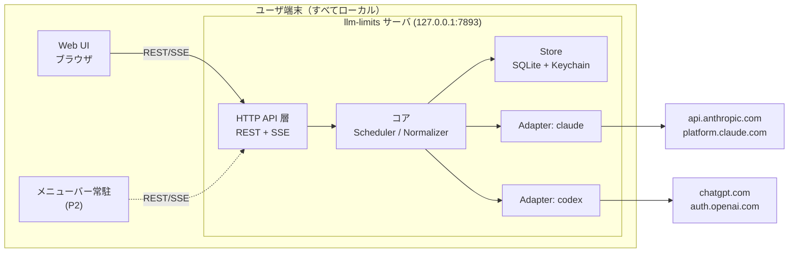
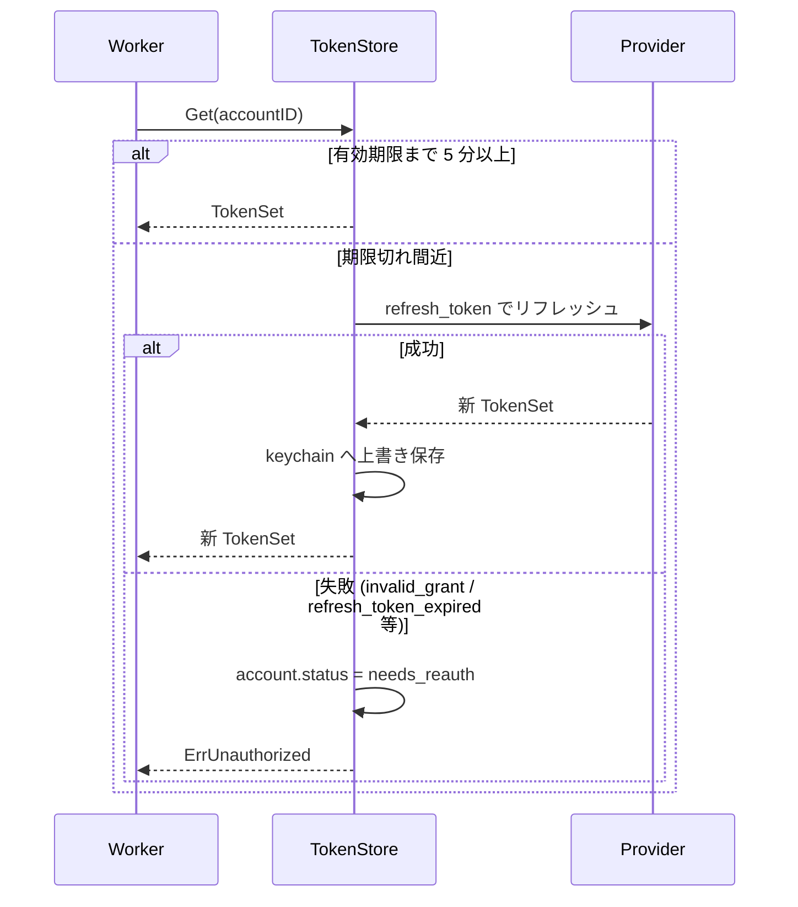
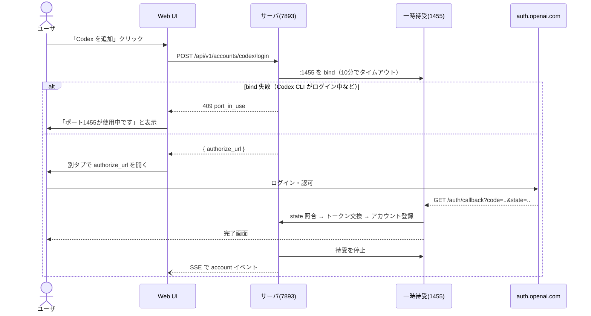
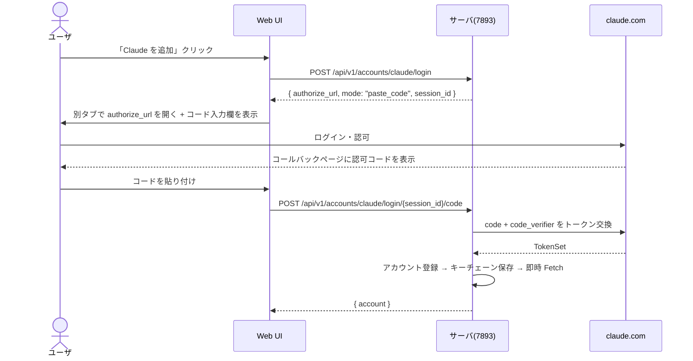
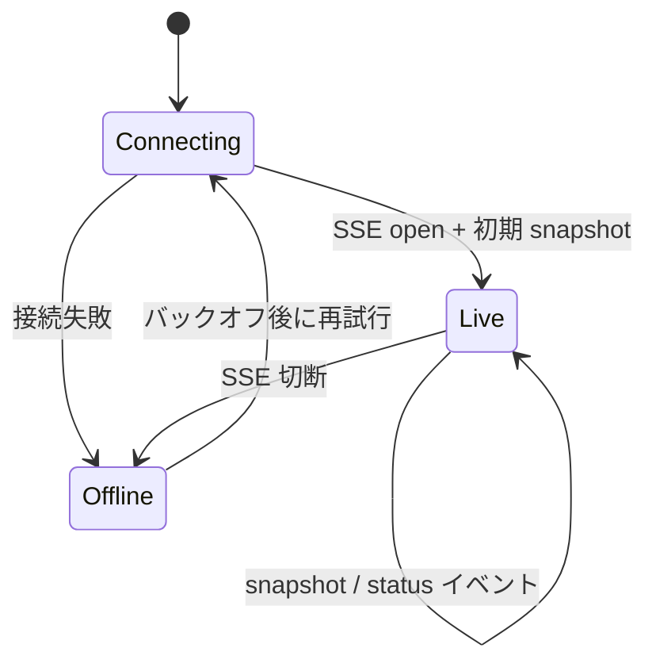

# llm-limits 詳細設計書

Claude（Anthropic サブスクリプション）と Codex（ChatGPT サブスクリプション）の
利用枠残量をリアルタイムに可視化するデスクトップアプリの詳細設計。

- ステータス: Draft v2
- 対象読者: 実装者
- 最終更新: 2026-08-29

> **v2 での変更**: 両プロバイダの残量取得手段・OAuth 定数を実物のソース／バイナリから確定させた（§6, §18）。
> v1 で「要検証」としていた項目、および「Codex は残量取得のたびに枠を消費しうる」という前提は解消された。

---

## 1. 目的とスコープ

### 1.1 目的

複数の LLM サブスクリプション契約について、**5時間枠と週間枠それぞれの消費率と次回リセット日時**を
常時把握できるようにする。作業の中断・待ち時間を減らすことが狙い。

### 1.2 表示要件（確定）

アカウントごとに、次の 2 行を表示する。これが本アプリの中核要件。

| 行 | 内容 |
|---|---|
| 5時間枠 | 消費率(%) と 次回リセット日時 |
| 週間枠 | 消費率(%) と 次回リセット日時 |

両プロバイダともこの 2 枠に対応する値を返す（§6）。
これ以外の枠（Claude の Opus 専用週間枠、Codex の追加レート制限、クレジット残高など）は
取得はするが、既定では折りたたみ、詳細表示でのみ出す。

### 1.3 スコープ

| フェーズ | 対象 | 本設計での扱い |
|---|---|---|
| P1 | サーバ（ローカル常駐デーモン） | 詳細設計 |
| P1 | OAuth ログイン用 Web 画面 | 詳細設計 |
| P1 | 残量表示 Web UI | 詳細設計 |
| P2 | 各 OS のメニューバー常駐クライアント | API 契約のみ確定、実装は後続 |

### 1.4 非スコープ

- 課金額・トークン単価の集計（API 従量課金は扱わない。サブスク枠のみ）
- マルチユーザ / チーム共有。**単一ユーザのローカル実行専用**
- クラウドホスティング（クレデンシャルをローカルに置く前提を崩さない）

### 1.5 設計原則

1. **ローカル完結**: サーバは `127.0.0.1` にのみバインドし、クレデンシャルは端末外に出さない。
2. **プロバイダ非依存のコア**: コアは正規化済みモデルだけを扱い、差異は Adapter に閉じ込める。
3. **控えめなポーリング**: 非公開エンドポイントに依存するため、リクエスト量は最小に抑える。
4. **UI は API のクライアントに過ぎない**: Web UI とメニューバーアプリは同じ REST/SSE を使う。

---

## 2. 用語

| 用語 | 定義 |
|---|---|
| Provider | `claude` / `codex` のいずれか |
| Account | Provider に紐づく 1 つのログイン済みアカウント。同一 Provider で複数可 |
| Window | リセット周期を持つ利用枠。本アプリでは主に 5時間枠 と 週間枠 |
| Snapshot | ある時刻に取得した Account の全 Window の状態 |
| Adapter | Provider 固有の OAuth と残量取得を実装するモジュール |

---

## 3. 全体アーキテクチャ



### 3.1 プロセス構成

単一プロセス・単一バイナリ。内部は以下の goroutine で構成する。

| goroutine | 役割 |
|---|---|
| `http` | API + Web UI の待受（固定ポート 7893） |
| `oauth-cb` | Codex ログイン中のみ一時起動するコールバック待受（ポート 1455、§8.2） |
| `scheduler` | アカウントごとのポーリングをスケジュール |
| `worker`（アカウント数分） | 取得実行、トークン更新、結果の書き込み |
| `broker` | Snapshot 更新を SSE 購読者へファンアウト |

---

## 4. 技術選定

### 4.1 サーバ: Go

- cgo なしでクロスコンパイル可能 → macOS(arm64/amd64) / Windows / Linux 向けに単一バイナリを配布できる
- 常駐時のメモリフットプリントが小さい（想定 20-30MB）
- OS キーチェーン抽象（`github.com/zalando/go-keyring`）が 3 OS 揃っている

| 用途 | ライブラリ |
|---|---|
| HTTP | 標準 `net/http`（Go 1.22 の `ServeMux` パターン） |
| DB | `modernc.org/sqlite`（pure Go / cgo 不要） |
| キーチェーン | `github.com/zalando/go-keyring` |
| ログ | 標準 `log/slog` |

**検討した代替**: Node/TypeScript。メニューバーを Electron にする場合に言語が揃うが、
常駐プロセスとしてのメモリ（Electron は 150MB+）と配布の重さで不採用。

### 4.2 Web UI: フレームワークなしの素の TS + Vite

画面数が 2 つ、状態も Snapshot のリストのみのため React を入れる必然性がない。
ビルド成果物は Go の `embed.FS` にバンドルし、サーバ単体で完結させる。

### 4.3 メニューバー常駐（P2 の方針のみ）: Tauri v2

Rust 側で `TrayIcon` を持ち、Web UI と同じ HTML 資産を再利用できる。
**サーバとは REST/SSE のみで会話するため、P2 で Electron に翻意しても設計への影響はない。**

---

## 5. データモデル

### 5.1 正規化モデル

**Provider 間の差異はここで吸収する。UI とネイティブクライアントはこの型しか知らない。**

```go
type Provider string   // "claude" | "codex"

// 枠の種別。表示要件 (§1.2) に直結する。
type WindowKind string
const (
    WindowFiveHour WindowKind = "five_hour" // 5時間枠
    WindowWeekly   WindowKind = "weekly"    // 週間枠
    WindowOther    WindowKind = "other"     // 上記以外（詳細表示のみ）
)

type Window struct {
    Kind        WindowKind
    Key         string     // Provider 固有の原キー（"seven_day_opus" 等）。Other の識別に使う
    Label       string     // UI 表示用 "5時間枠" / "週間枠(Opus)"
    UsedPercent float64    // 0.0 - 100.0 に正規化済み
    ResetsAt    *time.Time // 次回リセット日時。取れない場合のみ nil
    WindowMin   *int       // 枠の長さ（分）。Provider が返す場合のみ
}

type Account struct {
    ID        string    // ULID
    Provider  Provider
    Label     string    // 表示名（既定はメールアドレス）。ユーザ編集可
    Subject   string    // Provider 側のアカウント識別子（重複ログイン検出用）
    Plan      string    // "max20x" / "pro" 等
    Status    Status    // ok | needs_reauth | error | disabled
    CreatedAt time.Time
}

type Snapshot struct {
    AccountID string
    FetchedAt time.Time
    Windows   []Window
    Stale     bool   // 直近の取得に失敗し、前回値を返している
    Err       string // Stale 時の理由（UI 表示用、機微情報は含めない）
}
```

**設計判断: `Kind` による分類を Adapter の責務にする。**
Codex は枠の長さをサーバから受け取る方式（`limit_window_seconds`）で、
「primary が必ず 5 時間」とは限らない（Codex CLI 自身も長さから
ラベルを導出している。§18-C4）。したがってキー名ではなく**枠の長さで分類**する。

```go
// 枠の長さから Kind を決める。Codex CLI と同じ ±5% の許容幅を使う。
func classifyByLength(minutes int64) WindowKind {
    switch {
    case approx(minutes, 5*60):    return WindowFiveHour
    case approx(minutes, 7*24*60): return WindowWeekly
    default:                       return WindowOther
    }
}
func approx(m, expect int64) bool {
    f, e := float64(m), float64(expect)
    return f >= e*0.95 && f <= e*1.05
}
```

Claude は枠の長さを返さないため、**キー名で分類**する（`five_hour` → FiveHour、
`seven_day` → Weekly、それ以外 → Other）。分類ロジックが Provider ごとに違うことこそが
Adapter に閉じ込めるべき差異であり、コアはこの結果だけを見る。

### 5.2 永続化スキーマ（SQLite）

DB ファイル: `<config_dir>/llm-limits/data.db`（パーミッション 0600）

```sql
CREATE TABLE accounts (
    id          TEXT PRIMARY KEY,
    provider    TEXT NOT NULL,
    label       TEXT NOT NULL,
    subject     TEXT NOT NULL,
    plan        TEXT NOT NULL DEFAULT '',
    status      TEXT NOT NULL DEFAULT 'ok',
    created_at  INTEGER NOT NULL,
    UNIQUE(provider, subject)
);

-- 直近値。UI の初期表示とサーバ再起動時のコールドスタートに使う
CREATE TABLE snapshots (
    account_id  TEXT PRIMARY KEY REFERENCES accounts(id) ON DELETE CASCADE,
    fetched_at  INTEGER NOT NULL,
    payload     TEXT NOT NULL   -- []Window の JSON
);

-- 時系列（スパークライン用）。7日でローテート
CREATE TABLE snapshot_history (
    account_id  TEXT NOT NULL REFERENCES accounts(id) ON DELETE CASCADE,
    fetched_at  INTEGER NOT NULL,
    window_kind TEXT NOT NULL,
    used_pct    REAL NOT NULL,
    PRIMARY KEY (account_id, window_kind, fetched_at)
);
```

**トークンは SQLite に入れない**（§7）。`accounts.id` をキーにキーチェーンを引く。

---

## 6. Provider Adapter

### 6.1 インタフェース

```go
type Adapter interface {
    Provider() Provider

    // OAuth。フローの形が Provider 間で違う (§8) ため、開始と完了だけを共通化する
    BeginLogin() (*LoginSession, error)              // 認可 URL と待受方法を返す
    CompleteLogin(ctx, s *LoginSession, code string) (*TokenSet, *Identity, error)
    Refresh(ctx context.Context, refreshToken string) (*TokenSet, error)

    // 残量取得
    Fetch(ctx context.Context, t *TokenSet) ([]Window, error)

    MinInterval() time.Duration
}

type TokenSet struct {
    AccessToken  string
    RefreshToken string
    ExpiresAt    time.Time
    Extra        map[string]string // codex: chatgpt_account_id 等
}
```

`Fetch` のエラー分類と Scheduler の挙動:

| エラー種別 | Scheduler の動作 |
|---|---|
| `ErrUnauthorized` | 1 度だけ Refresh してリトライ。失敗なら `needs_reauth` に遷移し停止 |
| `ErrRateLimited`（429） | `Retry-After` を尊重。無ければ指数バックオフ |
| `ErrTransient`（5xx/ネットワーク） | 指数バックオフ、前回値を `Stale=true` で維持 |
| `ErrSchema` | 長い間隔でリトライ。**仕様変更の検出点**（§13.2） |

---

### 6.2 Claude Adapter

出典: Claude Code CLI バイナリ（`/opt/claude-code/bin/claude`）内の定数。詳細は §18-A。

#### OAuth

| 項目 | 値 |
|---|---|
| client_id | `9d1c250a-e61b-44d9-88ed-5944d1962f5e` |
| 認可 URL（サブスク） | `https://claude.com/cai/oauth/authorize` |
| 認可 URL（Console） | `https://platform.claude.com/oauth/authorize` |
| トークン URL | `https://platform.claude.com/v1/oauth/token` |
| redirect_uri | `https://platform.claude.com/oauth/code/callback` |
| scope | `user:profile user:inference`（他に `org:create_api_key` 等） |
| PKCE | S256 |

> **重要**: Claude 側にループバック（`http://localhost:PORT/...`）の redirect_uri は
> 見つからなかった。CLI は **Anthropic ホストのコールバックページに認可コードを表示させ、
> ユーザがそれを貼り付ける方式**を採る。本アプリも同じ方式にする（§8.3）。
> ループバックを前提にした設計にはできない。

#### 残量取得

```
GET https://api.anthropic.com/api/oauth/usage
GET https://api.anthropic.com/api/oauth/usage?at_wall=1&skip_spend=1   ← 軽量版

Authorization: Bearer <access_token>
anthropic-beta: oauth-2025-04-20
Content-Type: application/json
```

**読み取り専用であり、利用枠を消費しない。** タイムアウトは CLI 同様 5 秒。
401 の場合はトークンをリフレッシュして 1 度だけ再試行する（CLI と同じ挙動）。

レスポンス（トップレベルに枠ごとのオブジェクト）:

```json
{
  "five_hour":            { "utilization": 0.42,  "resets_at": 1786000000 },
  "seven_day":            { "utilization": 0.615, "resets_at": 1786400000 },
  "seven_day_opus":       { "utilization": 0.10,  "resets_at": 1786400000 },
  "seven_day_sonnet":     { "utilization": 0.55,  "resets_at": 1786400000 },
  "seven_day_oauth_apps": { "utilization": 0.02,  "resets_at": 1786400000 },
  "overage":              { "utilization": 0.0,   "resets_at": 1786400000 }
}
```

**正規化時の注意 2 点**

1. `utilization` は **0.0–1.0 の小数**。`UsedPercent` へは **×100** する。
   （CLI 内でも `used_percentage: utilization * 100` として換算している）
2. `resets_at` は **Unix エポック秒**（ミリ秒ではない）。

マッピング:

| API のキー | `Kind` | `Label` | 既定表示 |
|---|---|---|---|
| `five_hour` | `five_hour` | 5時間枠 | ✅ |
| `seven_day` | `weekly` | 週間枠 | ✅ |
| `seven_day_opus` | `other` | 週間枠(Opus) | 詳細のみ |
| `seven_day_sonnet` | `other` | 週間枠(Sonnet) | 詳細のみ |
| `seven_day_oauth_apps` | `other` | 週間枠(OAuth Apps) | 詳細のみ |
| `overage` | `other` | 追加利用 | 詳細のみ |

キーは将来増減しうるため、**未知のキーは `other` として取り込み、落とさない**。
`five_hour` と `seven_day` の欠落のみ `ErrSchema` とする。

---

### 6.3 Codex Adapter

出典: `openai/codex` リポジトリ（公開・Apache-2.0）。詳細は §18-C。

#### OAuth

| 項目 | 値 |
|---|---|
| issuer | `https://auth.openai.com` |
| client_id | `app_EMoamEEZ73f0CkXaXp7hrann` |
| 認可 URL | `https://auth.openai.com/oauth/authorize` |
| トークン URL | `https://auth.openai.com/oauth/token` |
| redirect_uri | `http://localhost:1455/auth/callback` |
| scope | `openid profile email offline_access api.connectors.read api.connectors.invoke` |
| PKCE | S256 |
| 追加クエリ | `id_token_add_organizations=true`, `codex_cli_simplified_flow=true`, `originator`, `state` |

> **重要**: **ポート 1455 は固定**。クライアント登録側で redirect_uri が
> このポートに固定されているため、任意ポートは使えない。§8.2 の設計はこれに従う。

リフレッシュは `POST https://auth.openai.com/oauth/token` に
JSON `{"client_id":..., "grant_type":"refresh_token", "refresh_token":...}`。
失敗時のエラーコード `refresh_token_expired` / `refresh_token_reused` /
`refresh_token_invalidated` はいずれも再ログインが必要な状態として `needs_reauth` に落とす。

`id_token` の `https://api.openai.com/auth` クレームから以下を取得する:

- `chatgpt_account_id` → 後述のリクエストヘッダに必要。`Account.Subject` にも使う
- `chatgpt_plan_type` → `Account.Plan`（`plus` / `pro` / `team` / `business` 等）
- `chatgpt_account_is_fedramp` → true なら `X-OpenAI-Fedramp: true` を付与

#### 残量取得

**専用の読み取り専用エンドポイントが存在する。**

```
GET https://chatgpt.com/backend-api/wham/usage

Authorization: Bearer <access_token>
ChatGPT-Account-Id: <chatgpt_account_id>
User-Agent: <任意>
```

**このエンドポイントは利用枠を消費しない。** v1 で懸念していた
「残量を知るために推論リクエストを投げる必要がある」という問題は存在しない。

レスポンス:

```json
{
  "plan_type": "pro",
  "rate_limit": {
    "allowed": true,
    "limit_reached": false,
    "primary_window":   { "used_percent": 12, "limit_window_seconds": 18000,
                          "reset_after_seconds": 9000, "reset_at": 1786000000 },
    "secondary_window": { "used_percent": 27, "limit_window_seconds": 604800,
                          "reset_after_seconds": 300000, "reset_at": 1786400000 }
  },
  "credits": { "has_credits": true, "unlimited": false, "balance": "12.50" },
  "additional_rate_limits": [ ... ],
  "rate_limit_reached_type": null
}
```

**正規化時の注意 3 点**

1. `used_percent` は **すでに 0–100 の整数**。Claude と違い ×100 しない。
2. `reset_at` は **Unix エポック秒**。`reset_after_seconds` も併記されるが、
   端末時計のずれに影響されない `reset_at` を採用する。
3. `Kind` は **`limit_window_seconds` から判定**する（§5.1 の `classifyByLength`）。
   `primary` = 5時間、`secondary` = 週間 という対応は**保証されていない**。
   18000 秒 → 5時間枠、604800 秒 → 週間枠。

`additional_rate_limits` と `credits` は `other` として取り込み、詳細表示でのみ出す。

#### フォールバック経路（実装しないが把握しておく）

`/wham/usage` が使えなくなった場合、同じ値は推論レスポンスからも得られる。

- **レスポンスヘッダ**: `x-codex-primary-used-percent`（小数可）,
  `x-codex-primary-window-minutes`, `x-codex-primary-reset-at`（エポック秒）と
  `x-codex-secondary-*` の同型。`x-{limit_id}-primary-*` で複数の枠系統が並ぶ。
- **SSE イベント**: `type: "codex.rate_limits"` のイベントに
  `rate_limits.primary.{used_percent, window_minutes, reset_at}` が入る。

この経路はリクエストを伴うため枠を消費する。**採用しない**が、
`/wham/usage` が 404 を返し始めたときの移行先として記録しておく。

---

### 6.4 非公開エンドポイント依存に関する注意

両 Provider とも、残量取得に公開ドキュメントのある API は存在しない。
Codex 側は Apache-2.0 のソースから確定できたが、Claude 側は配布バイナリ内の
文字列から確認したものであり、いずれも**予告なく変わりうる**。したがって:

- スキーマ不一致（`ErrSchema`）を明示的に検出・ログ化し、仕様変更に気づける状態を保つ。
- リクエスト量は公式クライアントの通常利用を上回らない水準に抑える（§9）。
- 自分のアカウントの状態を自分で読む用途に限定する。第三者アカウントの取得や
  取得結果の再配布は行わない。

---

## 7. クレデンシャル保存

### 7.1 保存先の優先順位

| 順位 | 保存先 | 対象 OS | 実現方法 |
|---|---|---|---|
| 1 | OS キーチェーン | macOS Keychain / Windows Credential Manager / Linux Secret Service | `go-keyring` |
| 2 | 暗号化ファイル | 上記が使えない環境（ヘッドレス Linux 等） | AES-256-GCM |

- キーチェーン: service = `llm-limits`, user = `<account_id>`, secret = `TokenSet` の JSON
- フォールバック: `<config_dir>/llm-limits/credentials.enc`（0600）、
  鍵は `<config_dir>/llm-limits/master.key`（0600, 32 バイト乱数）

**フォールバックの限界を明記する**: 鍵が同一ユーザのファイルシステム上にあるため、
これは「同一ユーザ権限で動くプロセス」からの保護にはならない。
保護対象は「設定ディレクトリごとバックアップ／同期してしまった際の平文流出」である。
このモードであることを起動時に警告ログへ出し、UI にもバッジで表示する。

### 7.2 トークンのライフサイクル



- リフレッシュは **singleflight** で同一アカウントの同時実行を 1 本に潰す。
- リフレッシュ成功時は旧 refresh_token を即座に破棄（ローテーションに対応）。
- **保存の失敗はリフレッシュ全体の失敗として扱う**。
  新トークンを保持したまま保存に失敗すると、再起動で復旧不能になるため。

### 7.3 ログとエラー出力

トークン・認可コード・`code_verifier` はログに出さない。
`slog.Handler` にマスキングフィルタを噛ませ、キー名に
`token` / `secret` / `authorization` / `code` を含む値を一律 `***` にする。
URL をログに出す場合はクエリの `code` / `redirect_uri` も同様に伏せる。

---

## 8. ログインフロー

**Provider ごとにフローの形が異なる**（Claude はコード貼り付け、Codex はループバック）。
この差異は Adapter の `BeginLogin` / `CompleteLogin` に閉じ込め、
UI からは「認可 URL を開く → 完了する」という同じ 2 ステップに見せる。

### 8.1 共通部分

- `state` は 32 バイト乱数の base64url。サーバのメモリ上に
  `state → {provider, verifier, expiresAt(10分)}` で保持する。
  DB には書かない（プロセス再起動時はログインをやり直させる方が安全）。
- PKCE は両者とも S256。
- 同一 `(provider, subject)` で再ログインした場合は新規追加ではなく
  **トークンの更新**として扱い、`needs_reauth` を解除する。これが再認証の導線を兼ねる。

### 8.2 Codex: ループバック方式（ポート 1455 固定）



**ポート 1455 を常時占有しない**のが要点。Codex CLI 自身が同じポートを使うため、
ログイン中の 10 分間だけ bind し、完了・中断・タイムアウトのいずれでも即座に解放する。

### 8.3 Claude: 認可コード貼り付け方式

Claude の redirect_uri は Anthropic ホストのページ（`https://platform.claude.com/oauth/code/callback`）で、
ループバックは使えない。そのため以下の流れになる。



**UI 上の配慮**: 認可 URL を開くボタンと入力欄を同一画面に並べ、
「別タブで承認 → 表示されたコードをここに貼る」という手順を明示する。
コードは `state` を含む形式で返ることがあるため、
サーバ側で `code#state` 形式・前後の空白・改行を許容してパースする。

`state` 照合はこの方式でも必ず行う（貼り付けられた値に含まれる state と保持中の state を比較）。

---

## 9. ポーリング設計

**両 Provider とも読み取り専用エンドポイントで枠を消費しない**ため、
v1 で設けた Provider ごとの間隔差は不要になった。既定は両者とも 60 秒。

### 9.1 スケジューリング

アカウントごとに独立したタイマーを持つ。

```
interval = max(adapter.MinInterval(), userConfiguredInterval)   // 既定 60s

// リセット直後の値を早く取りたいので、リセット時刻をまたぐ場合は寄せる
if 0 < timeUntilNearestReset < interval {
    next = nearestReset + 5s
} else {
    next = now + interval
}

if backoff.active { next = backoff.nextAt }   // バックオフ中は上書き
next += jitter(±10%)
```

**UI 非表示時の抑制**: SSE の購読者が 0 かつ最終アクセスから 10 分経過している場合、
間隔を 5 倍に伸ばす。購読が復活したら即座に 1 回 Fetch して通常間隔に戻す。
誰も見ていない時間帯に非公開 API を叩き続けないため。

### 9.2 バックオフ

| 種別 | 間隔 |
|---|---|
| `ErrRateLimited` | `Retry-After` があればそれ。無ければ 5分 → 10分 → 20分 → 30分（上限） |
| `ErrTransient` | 1分 → 2分 → 4分 → … → 30分（上限）。成功でリセット |
| `ErrSchema` | 30分固定。連続 3 回で `status=error`、UI に「取得方法の更新が必要」を表示 |

すべて ±10% のジッタを付与する。

### 9.3 失敗時の表示方針

取得に失敗しても直近の Snapshot を保持し、`Stale=true` と `FetchedAt` を返す。
UI は値をグレーアウトし「最終取得: N 分前」を表示する。**値を消さない**
（残量の目安としては古い値の方が「不明」より有用なため）。

---

## 10. HTTP API 仕様

- ベース URL: `http://127.0.0.1:7893`
- 認証: `Authorization: Bearer <local_token>`（§12.2）
- 表現: JSON。時刻は RFC3339（UTC）。

```json
{ "error": { "code": "needs_reauth", "message": "再ログインが必要です", "account_id": "01J..." } }
```

### 10.1 エンドポイント一覧

| Method | Path | 説明 |
|---|---|---|
| GET | `/api/v1/health` | 稼働確認。認証不要 |
| GET | `/api/v1/accounts` | アカウント一覧 |
| POST | `/api/v1/accounts/{provider}/login` | ログイン開始。`mode` で UI の分岐を指示 |
| POST | `/api/v1/accounts/claude/login/{session}/code` | 貼り付けコードの投入（§8.3） |
| DELETE | `/api/v1/accounts/{provider}/login/{session}` | ログイン中断（1455 の解放を含む） |
| PATCH | `/api/v1/accounts/{id}` | `label` / `disabled` の更新 |
| DELETE | `/api/v1/accounts/{id}` | 削除（キーチェーンのトークンも削除） |
| GET | `/api/v1/quotas` | 全アカウントの最新 Snapshot |
| GET | `/api/v1/quotas/{id}/history?kind=five_hour&hours=24` | 時系列（スパークライン用） |
| POST | `/api/v1/accounts/{id}/refresh` | 即時 Fetch（10秒に1回に制限） |
| GET | `/api/v1/stream` | SSE |
| GET / PUT | `/api/v1/config` | 設定の取得・更新 |
| GET | `/oauth/callback/codex` | Codex コールバック（ポート 1455 側で待受） |

### 10.2 `POST /api/v1/accounts/{provider}/login` レスポンス

```json
// codex
{ "session_id": "s_01J...", "authorize_url": "https://auth.openai.com/oauth/authorize?...",
  "mode": "loopback", "expires_at": "2026-08-29T10:15:00Z" }

// claude
{ "session_id": "s_01J...", "authorize_url": "https://claude.com/cai/oauth/authorize?...",
  "mode": "paste_code", "expires_at": "2026-08-29T10:15:00Z" }
```

UI は `mode` を見て、コード入力欄を出すかコールバック待ちにするかを決める。

### 10.3 `GET /api/v1/quotas` レスポンス

```json
{
  "fetched_at": "2026-08-29T09:20:03Z",
  "accounts": [
    {
      "account": { "id": "01J8ZQ...", "provider": "claude", "label": "work@example.com",
                   "plan": "max20x", "status": "ok" },
      "snapshot": {
        "fetched_at": "2026-08-29T09:20:01Z", "stale": false,
        "windows": [
          { "kind": "five_hour", "key": "five_hour", "label": "5時間枠",
            "used_percent": 42.0, "resets_at": "2026-08-29T11:00:00Z" },
          { "kind": "weekly", "key": "seven_day", "label": "週間枠",
            "used_percent": 61.5, "resets_at": "2026-09-02T00:00:00Z" },
          { "kind": "other", "key": "seven_day_opus", "label": "週間枠(Opus)",
            "used_percent": 10.0, "resets_at": "2026-09-02T00:00:00Z" }
        ]
      }
    },
    {
      "account": { "id": "01J8ZR...", "provider": "codex", "label": "personal",
                   "plan": "pro", "status": "ok" },
      "snapshot": {
        "fetched_at": "2026-08-29T09:19:44Z", "stale": false,
        "windows": [
          { "kind": "five_hour", "key": "primary", "label": "5時間枠",
            "used_percent": 12.0, "resets_at": "2026-08-29T13:30:00Z", "window_min": 300 },
          { "kind": "weekly", "key": "secondary", "label": "週間枠",
            "used_percent": 27.0, "resets_at": "2026-09-02T09:00:00Z", "window_min": 10080 }
        ]
      }
    }
  ]
}
```

クライアントは `kind` が `five_hour` / `weekly` のものを既定表示し、
`other` は詳細表示に回す。**キー名ではなく `kind` で分岐する。**

### 10.4 SSE (`GET /api/v1/stream`)

```
event: snapshot
data: {"account_id":"01J8ZQ...","snapshot":{...}}

event: account
data: {"action":"added","account":{...}}

event: status
data: {"account_id":"01J8ZQ...","status":"needs_reauth"}

: keepalive   ← 20 秒ごと
```

接続時にまず全アカウントの `snapshot` を流す（初期同期）。
これによりクライアントは `stream` だけで完結できる。
切断時は指数バックオフ（1秒 → 30秒上限）で再接続する。

---

## 11. Web UI 設計

### 11.1 画面一覧

| 画面 | パス | 内容 |
|---|---|---|
| ダッシュボード | `/` | 全アカウントの残量カード一覧 |
| 設定 | `/settings` | アカウント追加/削除/リネーム、ポーリング間隔 |

### 11.2 ダッシュボード

表示要件（§1.2）そのままに、1 アカウント 2 行を基本とする。

```
┌────────────────────────────────────────────────────────┐
│ llm-limits                          ⟳ 3秒前       ⚙   │
├────────────────────────────────────────────────────────┤
│ ● Claude — work@example.com                    max20x  │
│   5時間枠  ▓▓▓▓▓▓░░░░░░░░  42%   11:00 リセット (2時間後) │
│   週間枠   ▓▓▓▓▓▓▓▓▓░░░░░  62%   9/2 09:00 (4日後)      │
│   ▸ その他の枠 (3)                                      │
├────────────────────────────────────────────────────────┤
│ ● Codex — personal                                pro  │
│   5時間枠  ▓▓░░░░░░░░░░░░  12%   13:30 リセット (4時間後) │
│   週間枠   ▓▓▓▓░░░░░░░░░░  27%   9/2 09:00 (4日後)      │
├────────────────────────────────────────────────────────┤
│ ⚠ Claude — old@example.com          再ログインが必要     │
└────────────────────────────────────────────────────────┘
```

- **リセット日時は絶対時刻を主、相対時間を従**として併記する。
  「2時間後」だけだと予定を立てにくく、絶対時刻だけだと直感が働かないため。
  日付が今日ならば時刻のみ、翌日以降は日付を添える。
- 残量バーの色は 3 段階（`< 70%` 通常 / `70–90%` 注意 / `>= 90%` 警告）。
  **色だけに意味を持たせず**、数値とテキストラベルを併記する。
- `stale` のカードは彩度を落とし「最終取得 N 分前」を明示する。
- `needs_reauth` のカードは値を出さず、再ログインボタンのみを出す。
- `kind: other` の枠は既定で折りたたむ（`▸ その他の枠 (3)`）。

### 11.3 状態遷移（クライアント側）



`Offline` の間もキャッシュした最終値を表示し続け、
ヘッダに「サーバに接続できません」を出す。

### 11.4 メニューバー常駐クライアント（P2 の要件メモ）

本設計では実装しないが、API を確定させるうえでの前提:

- メニューバーには**最も逼迫している枠の使用率**を 1 つだけ数値表示する
  （どの枠を出すかは設定で固定も可能）
- クリックでポップオーバー。中身はダッシュボードと同じ
- 閾値（既定 90%）超過で 1 度だけ OS 通知。リセットで再武装
- サーバプロセスは常駐アプリが子プロセスとして起動・監視する
  （起動済みなら `/api/v1/health` で検出して再利用）

---

## 12. セキュリティ設計

### 12.1 攻撃面

| 資産 | 脅威 | 対策 |
|---|---|---|
| OAuth トークン | 他プロセスからの読み出し | OS キーチェーン。フォールバック時は §7.1 の限界を明示 |
| ローカル API | 同一端末の他プロセス／他ユーザからの利用 | `127.0.0.1` バインド + Bearer トークン |
| ローカル API | 悪意あるサイトからの CSRF / DNS リバインディング | Origin 検証 + `Host` 検証 + Bearer |
| 認可フロー | 認可コード横取り | PKCE(S256) + `state` 検証 |
| ポート 1455 | ログイン中に他プロセスが横取り | bind 失敗時は 409 を返して中断。成功時のみ URL を発行 |

### 12.2 ローカル API トークン

- 起動時に 32 バイト乱数を生成し、`<config_dir>/llm-limits/api.token`（0600）に保存
- Web UI はサーバが開く URL `http://127.0.0.1:7893/?t=<token>` で受け取り、
  `sessionStorage` に格納してから **`history.replaceState` で URL から即座に除去**する
- `/api/v1/health` と Codex コールバック以外の全エンドポイントで必須
- ブラウザ外のクライアント（メニューバーアプリ）はトークンファイルを直接読む

### 12.3 ブラウザ由来リクエストの制限

- `Origin` が存在する場合、`http://127.0.0.1:7893` / `http://localhost:7893` 以外は 403
- `Host` ヘッダも同様に検証（DNS リバインディング対策）
- CORS は許可しない（`Access-Control-Allow-Origin` を返さない）
- 静的資産に CSP: `default-src 'self'; connect-src 'self'`

### 12.4 その他

- 外向き通信は §6 に挙げたドメインのみ。テレメトリ・クラッシュレポートの送信は行わない
- アカウント削除時はキーチェーンのエントリと DB の行の両方を削除し、
  可能であれば Provider 側のトークン失効エンドポイント
  （Codex: `https://auth.openai.com/oauth/revoke`）も呼ぶ

---

## 13. 可観測性と運用

### 13.1 ログ

`log/slog` の JSON ハンドラ。既定 `info`、`--log-level=debug` で詳細化。
出力先は stderr と `<config_dir>/llm-limits/app.log`（10MB × 3 世代でローテート）。

主要イベント: 起動／終了、アカウント追加／削除、Fetch 成否とレイテンシ、
トークンリフレッシュ、バックオフ突入、スキーマ不一致。§7.3 のマスキングを必ず通す。

### 13.2 デバッグ用エンドポイント

`--debug` 起動時のみ有効化する。

| Path | 内容 |
|---|---|
| `/debug/adapters` | 各 Adapter の直近の生レスポンス（トークンはマスク） |
| `/debug/schedule` | 各アカウントの次回実行時刻とバックオフ状態 |

非公開エンドポイントに依存する以上、`ErrSchema` の調査が最も頻繁に必要になる。
そのコストを下げるために用意する。

### 13.3 設定ファイル

`<config_dir>/llm-limits/config.toml`

```toml
port = 7893
open_browser_on_start = true

[polling]
interval        = "60s"
idle_multiplier = 5      # SSE 購読者が 0 のときの倍率

[notify]
threshold_percent = 90
```

config_dir は macOS `~/Library/Application Support`、
Linux `$XDG_CONFIG_HOME`（既定 `~/.config`）、Windows `%APPDATA%`。

---

## 14. ディレクトリ構成

```
llm-limits/
├── cmd/llm-limits/main.go
├── internal/
│   ├── server/
│   │   ├── router.go
│   │   ├── middleware.go         # Bearer / Origin / Host 検証
│   │   ├── handlers_accounts.go
│   │   ├── handlers_quotas.go
│   │   ├── handlers_login.go     # 8.2 / 8.3 の両方式
│   │   ├── loopback.go           # ポート1455の一時待受
│   │   └── sse.go
│   ├── core/
│   │   ├── model.go              # Account / Window / Snapshot / WindowKind
│   │   ├── classify.go           # classifyByLength (§5.1)
│   │   ├── scheduler.go
│   │   └── errors.go
│   ├── adapter/
│   │   ├── adapter.go
│   │   ├── claude/{oauth.go,usage.go,usage_test.go}
│   │   └── codex/{oauth.go,usage.go,usage_test.go}
│   ├── store/
│   │   ├── sqlite.go
│   │   ├── keychain.go
│   │   └── migrations/
│   └── config/config.go
├── web/                          # Vite。dist を go:embed
├── docs/design.md                # 本書
└── .github/workflows/release.yml
```

---

## 15. テスト方針

| 層 | 方針 |
|---|---|
| Adapter | 実 API から一度採取したレスポンスを testdata に固定し、パースを検証。**ネットワークに出ない** |
| Adapter | 単位換算の回帰テストを必ず置く（Claude の ×100、Codex の等倍） |
| classify | 18000秒→5h、604800秒→weekly、境界（±5%）と想定外値 |
| Scheduler | 時刻を注入可能にし（`clock` インタフェース）、バックオフ・リセット寄せを検証 |
| Store | 一時ディレクトリの SQLite で実行。キーチェーンはインメモリ実装に差し替え |
| API | `httptest` でミドルウェア（Bearer 欠落 403、不正 Origin 403）を検証 |
| E2E | OAuth と Provider API をモックしたスタブサーバで、ログイン〜表示まで通す |

**単位換算のテストを明示的に挙げているのは、
`utilization`(0–1) と `used_percent`(0–100) の取り違えが
「100倍ずれた値を自信を持って表示する」形の障害になるため。**

パースは未知フィールドを無視しつつ、`five_hour` / `weekly` に対応する枠の欠落は
`ErrSchema` として明示的にエラーにする。

---

## 16. 実装フェーズ

| Phase | 内容 | 完了条件 |
|---|---|---|
| P0 | スケルトン: 設定、SQLite、HTTP、Bearer ミドルウェア | `/api/v1/health` が 200 |
| P1a | Codex Adapter（OAuth、§8.2） | ログインしトークンがキーチェーンに入る |
| P1b | Codex Adapter（Fetch）+ Scheduler + `/quotas` | `codex` CLI の `/status` と値が一致する |
| P1c | Web UI ダッシュボード + SSE | 5h/週間の消費率とリセット時刻がリアルタイム更新される |
| P2a | Claude Adapter（OAuth、§8.3 の貼り付け方式） | 同上 |
| P2b | Claude Adapter（Fetch） | `claude` CLI の `/usage` と値が一致する |
| P3 | 設定画面、history/スパークライン、リリースワークフロー | 3 OS のバイナリが CI から出る |
| P4 | Tauri メニューバークライアント | 本設計の対象外（別途設計） |

**v1 から Claude と Codex の順序を入れ替えた。** Codex はソースが公開されており
仕様の確度が最も高く、ループバック方式でフローも単純なため、
コア（Scheduler・正規化・SSE・UI）の検証台として先に通すのが速い。
Claude の貼り付け方式は UI に追加の作り込みが要るので後段に置く。

完了条件を「公式クライアントの表示と一致」に置いているのは、
非公開エンドポイントを使う以上、正しさの基準がそこにしかないため。

---

## 17. リスクと未決事項

| # | 項目 | 影響 | 対応方針 |
|---|---|---|---|
| R1 | 残量取得エンドポイントが非公開で、予告なく変わる | 機能停止 | `ErrSchema` 検出 + `/debug/adapters`（§13.2）。Adapter を薄く保つ。Codex は §6.3 のフォールバック経路が控えとして存在する |
| R2 | ポート 1455 が Codex CLI と競合する | ログイン失敗 | ログイン中のみ bind。失敗時は 409 と明確なメッセージ（§8.2） |
| R3 | Claude の貼り付け方式が UX 上の摩擦になる | 導入時の離脱 | 手順を 1 画面に集約。将来ループバックが許可されたら §8.2 方式へ寄せる |
| R4 | OAuth の client_id / scope が変わる | ログイン不能 | 定数を 1 ファイルに集約し、設定で上書き可能にする |
| R5 | 各サービスの利用規約 | 配布時の問題 | 自アカウントの状態取得に限定。リクエスト量を公式クライアント以下に抑える |
| R6 | キーチェーン非対応環境での保護が弱い | 情報漏洩 | §7.1 の限界を UI・ログで明示 |
| R7 | Claude の `utilization` と Codex の `used_percent` のスケール差 | 100倍ずれた値の表示 | 換算を Adapter 内に閉じ、§15 の回帰テストで固定 |

### 実装着手前に確定させるべきこと

v1 で挙げた 3 点はすべて解消した（§18 に根拠を記載）。残る確認事項は次の 2 点で、
いずれも**実アカウントでの初回疎通時にしか確認できない**類のもの。

1. `GET /api/oauth/usage` のレスポンスに含まれる枠キーの実際の顔ぶれ
   （プランによって `seven_day_opus` の有無などが変わる想定）。
   → 未知キーは `other` として取り込む設計なので、**実装をブロックしない**。
2. Claude の認可コード貼り付けフローで、コードに `state` が
   どの形式で同梱されるか（`code#state` 形式を想定）。
   → §8.3 のパースを寛容にすることで吸収する。

---

## 18. 根拠となる出典

本設計の Provider 固有の記述は、以下の実物から確認した。
**推測で書いた箇所はない。**変更に気づけるよう、確認元を残しておく。

### A. Claude

出典: Claude Code CLI 実行バイナリ（`/opt/claude-code/bin/claude`、2026-08 時点）内の文字列。
Claude Code のソースは非公開のため、配布物からの確認となる。

| 事実 | 確認内容 |
|---|---|
| 使用量エンドポイント | `/api/oauth/usage`、および `?at_wall=1&skip_spend=1` 付きの軽量版 |
| リクエスト | `GET`、`timeout: 5000`、`Content-Type: application/json`、401 で OAuth リフレッシュ後に 1 回再試行 |
| beta ヘッダ | `oauth-2025-04-20` |
| レスポンス構造 | `five_hour` / `seven_day` / `seven_day_opus` / `seven_day_sonnet` / `seven_day_oauth_apps` / `overage` の各キーに `{utilization, resets_at}` |
| 単位 | `used_percentage: utilization * 100` の換算が存在 → `utilization` は 0–1 |
| リセット時刻 | `resets_at * 1000 > Date.now()` の比較が存在 → エポック**秒** |
| OAuth 定数 | `CLIENT_ID: 9d1c250a-e61b-44d9-88ed-5944d1962f5e`, `CLAUDE_AI_AUTHORIZE_URL: https://claude.com/cai/oauth/authorize`, `TOKEN_URL: https://platform.claude.com/v1/oauth/token`, `MANUAL_REDIRECT_URL: https://platform.claude.com/oauth/code/callback` |
| ループバックの不在 | バイナリ内の `http://localhost:PORT` はすべて開発用ベース URL（3000/4000/8000）で、OAuth コールバック用のループバックは存在しない |

### B. Codex

出典: [`openai/codex`](https://github.com/openai/codex)（Apache-2.0）、commit `6478a75`。

| 事実 | ファイル |
|---|---|
| 使用量エンドポイント `{base}/wham/usage`（ChatGPT 系）/ `{base}/api/codex/usage` | `codex-rs/backend-client/src/client/rate_limit_resets.rs:81-84` |
| `GET` かつ読み取り専用（`get_rate_limit_status`） | 同 `:31-35` |
| ベース URL `https://chatgpt.com/backend-api` の自動補完 | `codex-rs/backend-client/src/client.rs:181-193` |
| リクエストヘッダ（Bearer + `ChatGPT-Account-Id` + `X-OpenAI-Fedramp`） | 同 `:242-262` |
| レスポンス構造 `plan_type` / `rate_limit` / `credits` / `additional_rate_limits` | `codex-rs/codex-backend-openapi-models/src/models/rate_limit_status_payload.rs` |
| `primary_window` / `secondary_window` | `.../rate_limit_status_details.rs` |
| 窓の中身 `used_percent`(整数) / `limit_window_seconds` / `reset_after_seconds` / `reset_at` | `.../rate_limit_window_snapshot.rs` |
| ヘッダ経由の同等値 `x-codex-{primary,secondary}-{used-percent,window-minutes,reset-at}` | `codex-rs/codex-api/src/rate_limits.rs:60-95` |
| SSE イベント `codex.rate_limits` | 同 `:107-160` |
| **枠の長さからラベルを導出**（5h / daily / weekly / monthly / annual、±5%） | `codex-rs/tui/src/chatwidget/rate_limits.rs:77-106` |
| OAuth: issuer / port / scope / PKCE / 追加クエリ | `codex-rs/login/src/server.rs:59-60,176,575-611` |
| OAuth: `CLIENT_ID: app_EMoamEEZ73f0CkXaXp7hrann`、token/revoke URL | `codex-rs/login/src/auth/manager.rs:197-201,1708` |
| リフレッシュ要求の形 `{client_id, grant_type, refresh_token}` | 同 `:1694-1705` |
| `id_token` クレーム名前空間 `https://api.openai.com/auth` | `codex-rs/login/src/token_data.rs:29-42,71-99` |

**C4 の含意**: Codex CLI 自身が「primary = 5時間」と決め打ちせず
窓の長さからラベルを導出している。本設計が §5.1 で
`classifyByLength` を採る根拠がこれで、`primary`/`secondary` という
位置に意味を持たせるべきではない。
