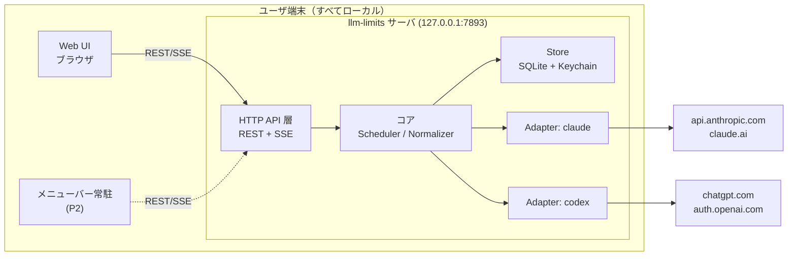
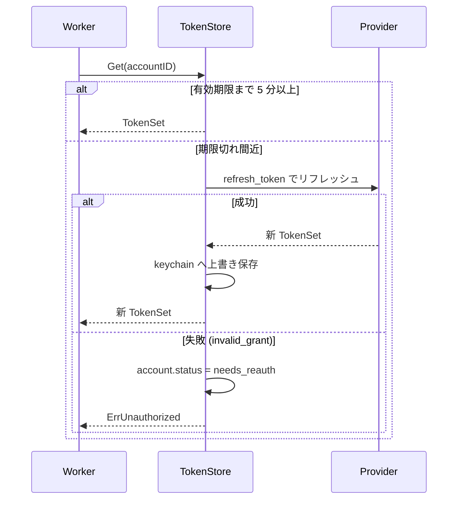
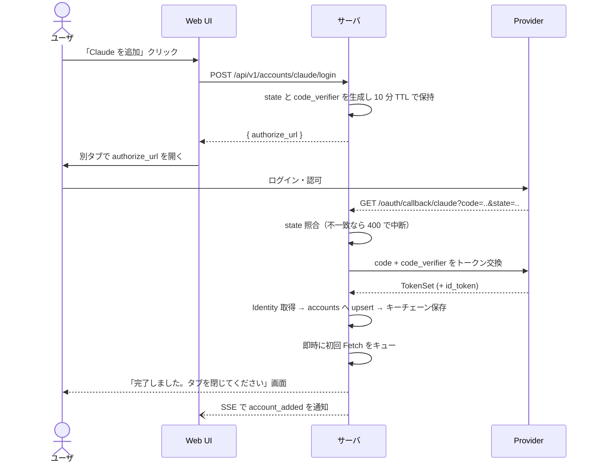
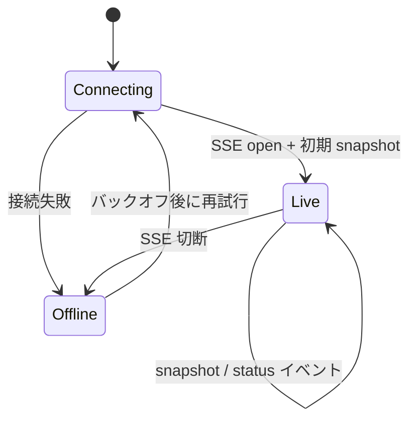

# llm-limits 詳細設計書

Claude（Anthropic サブスクリプション）と Codex（OpenAI / ChatGPT サブスクリプション）の
利用枠（レートリミット）残量をリアルタイムに可視化するデスクトップアプリの詳細設計。

- ステータス: Draft v1
- 対象読者: 実装者
- 最終更新: 2026-08-29

---

## 1. 目的とスコープ

### 1.1 目的

複数の LLM サブスクリプション契約について、「あと何%使えるか / いつリセットされるか」を
常時把握できるようにする。作業の中断・待ち時間を減らすことが狙い。

### 1.2 スコープ（本設計の対象）

| フェーズ | 対象 | 本設計での扱い |
|---|---|---|
| P1 | サーバ（ローカル常駐デーモン） | 詳細設計 |
| P1 | OAuth ログイン用 Web 画面 | 詳細設計 |
| P1 | 残量表示 Web UI | 詳細設計 |
| P2 | 各 OS のメニューバー常駐クライアント | API 契約のみ確定、実装は後続 |

### 1.3 非スコープ

- 課金額・トークン単価の集計（API 従量課金の話は扱わない。サブスク枠のみ）
- マルチユーザ / チーム共有。**単一ユーザのローカル実行専用**
- クラウドホスティング（クレデンシャルをローカルに置く前提を崩さない）

### 1.4 設計原則

1. **ローカル完結**: サーバは `127.0.0.1` にのみバインドし、クレデンシャルは端末外に出さない。
2. **プロバイダ非依存のコア**: 残量の取得方法はプロバイダごとに大きく違うため、
   コアは正規化済みモデルだけを扱い、差異は Adapter に閉じ込める。
3. **控えめなポーリング**: 非公式エンドポイントに依存するため、リクエスト量は最小に抑える。
4. **UI は API のクライアントに過ぎない**: Web UI とメニューバーアプリは同じ REST/SSE を使う。
   これにより P2 のネイティブクライアントはサーバに一切変更を要求しない。

---

## 2. 用語

| 用語 | 定義 |
|---|---|
| Provider | `claude` / `codex` のいずれか。サブスクの提供元 |
| Account | Provider に紐づく 1 つのログイン済みアカウント。同一 Provider で複数可 |
| Window | リセット周期を持つ利用枠の単位（例: 5時間枠、週次枠） |
| Snapshot | ある時刻に取得した Account の全 Window の状態 |
| Adapter | Provider 固有の OAuth と残量取得を実装するモジュール |
| Probe | 残量を取得するための実際の HTTP リクエスト |

---

## 3. 全体アーキテクチャ



### 3.1 プロセス構成

単一プロセス・単一バイナリ。内部は以下の goroutine で構成する。

| goroutine | 役割 |
|---|---|
| `http` | API + Web UI + OAuth コールバックの待受 |
| `scheduler` | アカウントごとのポーリングをスケジュール |
| `worker`（アカウント数分） | Probe 実行、トークン更新、結果の書き込み |
| `broker` | Snapshot 更新を SSE 購読者へファンアウト |

---

## 4. 技術選定

### 4.1 サーバ: Go

**採用理由**

- cgo なしでクロスコンパイル可能 → macOS(arm64/amd64) / Windows / Linux 向けに
  CI から単一バイナリを配布できる。常駐デーモンとして配布形態が最も簡単。
- 常駐時のメモリフットプリントが小さい（想定 20-30MB）。
- OS キーチェーン抽象（`github.com/zalando/go-keyring`）が 3 OS 揃っている。

**主要依存**

| 用途 | ライブラリ |
|---|---|
| HTTP ルーティング | 標準 `net/http`（Go 1.22 の `ServeMux` パターンで十分） |
| DB | `modernc.org/sqlite`（pure Go / cgo 不要） |
| キーチェーン | `github.com/zalando/go-keyring` |
| 構造化ログ | 標準 `log/slog` |

**検討した代替**: Node/TypeScript。メニューバーを Electron にする場合に言語が揃う利点はあるが、
常駐プロセスとしてのメモリ（Electron は 150MB+）と配布の重さで不採用。

### 4.2 Web UI: フレームワークなしの素の TS + Vite

画面数が 2 つで、状態も Snapshot のリストのみ。React を入れる必然性がない。
ビルド成果物は Go の `embed.FS` にバンドルし、サーバ単体で完結させる。

### 4.3 メニューバー常駐（P2 の方針のみ）: Tauri v2

Rust 側で `TrayIcon` を持ち、Web UI と同じ HTML 資産を再利用できる。
バイナリサイズ・メモリともに Electron より有利。**サーバとは REST/SSE のみで会話するため、
P2 で Electron に翻意しても設計への影響はない。**

---

## 5. データモデル

### 5.1 正規化モデル

Provider 間の差異を吸収するための共通表現。**UI とネイティブクライアントはこの型しか知らない。**

```go
type Provider string // "claude" | "codex"

type Account struct {
    ID        string    // ULID
    Provider  Provider
    Label     string    // 表示名。既定はメールアドレス等、ユーザ編集可
    Subject   string    // Provider 側のアカウント識別子（重複ログイン検出用）
    Plan      string    // "max20x", "plus" 等。取得できなければ ""
    Status    Status    // ok | needs_reauth | error | disabled
    CreatedAt time.Time
}

type Window struct {
    Key         string     // "5h" / "7d" / "7d_opus" — Provider 内で一意
    Label       string     // UI 表示用 "5時間枠"
    UsedPercent float64    // 0.0 - 100.0。これが唯一の必須指標
    Used        *float64   // 実数が取れる場合のみ
    Limit       *float64   // 同上
    Unit        string     // "percent" | "tokens" | "messages" | "credits"
    ResetsAt    *time.Time // 次回リセット時刻
    WindowMin   *int       // 枠の長さ（分）
}

type Snapshot struct {
    AccountID string
    FetchedAt time.Time
    Windows   []Window
    Source    string  // "api" | "cache" | "header"
    Stale     bool    // 直近の取得に失敗し、前回値を返している
    Err       string  // Stale 時の理由（UI 表示用、機微情報は含めない）
}
```

**設計判断**: `UsedPercent` のみを必須とし、`Used`/`Limit` を optional にしている。
Codex は使用率パーセントしか返さないケースがあり、
共通スキーマを実数ベースにすると Codex 側が常に欠損になるため。

### 5.2 永続化スキーマ（SQLite）

DB ファイル: `<config_dir>/llm-limits/data.db`（パーミッション 0600）

```sql
CREATE TABLE accounts (
    id          TEXT PRIMARY KEY,
    provider    TEXT NOT NULL,
    label       TEXT NOT NULL,
    subject     TEXT NOT NULL,
    plan        TEXT NOT NULL DEFAULT '',
    status      TEXT NOT NULL DEFAULT 'ok',
    created_at  INTEGER NOT NULL,
    UNIQUE(provider, subject)
);

-- 直近値。UI の初期表示とサーバ再起動時のコールドスタートに使う
CREATE TABLE snapshots (
    account_id  TEXT PRIMARY KEY REFERENCES accounts(id) ON DELETE CASCADE,
    fetched_at  INTEGER NOT NULL,
    payload     TEXT NOT NULL   -- []Window の JSON
);

-- 時系列（スパークライン用）。7日でローテート
CREATE TABLE snapshot_history (
    account_id  TEXT NOT NULL REFERENCES accounts(id) ON DELETE CASCADE,
    fetched_at  INTEGER NOT NULL,
    window_key  TEXT NOT NULL,
    used_pct    REAL NOT NULL,
    PRIMARY KEY (account_id, window_key, fetched_at)
);
```

**トークンは SQLite に入れない**（§7）。`accounts.id` をキーにキーチェーンを引く。

---

## 6. Provider Adapter

### 6.1 インタフェース

```go
type Adapter interface {
    Provider() Provider

    // OAuth
    AuthURL(state, verifier string) (url string, redirectURI string)
    Exchange(ctx context.Context, code, verifier string) (*TokenSet, *Identity, error)
    Refresh(ctx context.Context, refreshToken string) (*TokenSet, error)

    // 残量取得
    Fetch(ctx context.Context, t *TokenSet) ([]Window, error)

    // 推奨ポーリング間隔（Adapter が Probe コストを知っているため Adapter 側で決める）
    MinInterval() time.Duration
}

type TokenSet struct {
    AccessToken  string
    RefreshToken string
    ExpiresAt    time.Time
    Extra        map[string]string // account_id 等、Provider 固有
}
```

`Fetch` が返すエラーは以下に分類し、Scheduler の挙動を変える。

| エラー種別 | Scheduler の動作 |
|---|---|
| `ErrUnauthorized` | 1 度だけ Refresh してリトライ。失敗なら `needs_reauth` に遷移し停止 |
| `ErrRateLimited`（429） | `Retry-After` を尊重。無ければ指数バックオフ |
| `ErrTransient`（5xx/ネットワーク） | 指数バックオフ、前回値を `Stale=true` で維持 |
| `ErrSchema` | ログに記録して長い間隔でリトライ。**仕様変更の検出点** |

### 6.2 Claude Adapter

**認証**: Authorization Code + PKCE(S256)、ループバックリダイレクト。
Claude Code CLI と同じ OAuth クライアントを利用する。

| 項目 | 値 | 確度 |
|---|---|---|
| 認可エンドポイント | `https://claude.ai/oauth/authorize` | 要検証 |
| トークンエンドポイント | `https://console.anthropic.com/v1/oauth/token` | 要検証 |
| client_id | Claude Code CLI 同梱の公開クライアント ID | **実装前に実物から取得** |
| redirect_uri | `http://127.0.0.1:7893/oauth/callback/claude` | 本設計で固定 |
| scope | `user:profile user:inference` | 要検証 |

**残量取得**: `GET /api/oauth/usage` 相当のエンドポイントに Bearer トークンを付与。
`5時間枠` と `週次枠`（さらにモデル別枠が分かれる場合あり）の利用率とリセット時刻が得られる想定。

Window マッピング:

| API 上の枠 | `Key` | `Label` |
|---|---|---|
| 5 時間枠 | `5h` | 5時間枠 |
| 週次枠（全体） | `7d` | 週間枠 |
| 週次枠（上位モデル） | `7d_opus` | 週間枠(Opus) |

**Probe コスト**: 読み取り専用エンドポイントであり、利用枠を消費しない見込み。
→ `MinInterval() = 60s`。

### 6.3 Codex Adapter

**認証**: ChatGPT アカウントの OAuth（Authorization Code + PKCE）。
Codex CLI と同じ公開クライアントを利用する。
`id_token` のクレームに plan 種別（`chatgpt_plan_type`）と `account_id` が含まれるため、
`Identity.Plan` はここから取る。

| 項目 | 値 | 確度 |
|---|---|---|
| Issuer | `https://auth.openai.com` | 要検証 |
| redirect_uri | `http://127.0.0.1:7893/oauth/callback/codex` | 本設計で固定 |

**残量取得**: ここが本設計で最も不確実な部分。以下の優先順で実装する。

1. **専用の使用量エンドポイントがあればそれを使う**（読み取り専用・枠を消費しない）。
2. 無ければ、**推論エンドポイントのレスポンスヘッダ**から取得する。
   Codex のバックエンドは応答に利用率ヘッダ（プライマリ枠 / セカンダリ枠それぞれの
   使用率・窓長・リセットまでの秒数）を載せる。この場合、
   **残量を知るためにリクエストを 1 回投げる必要がある**。

2 の場合の設計上の帰結:

- Probe は「最小コストのリクエスト」とする（最小トークンの入力、`max_output_tokens` 最小）。
- **Probe 自体が枠を消費しうる**ため `MinInterval() = 15分` とし、既定のポーリング間隔も
  Claude とは独立に持つ。UI にも「Codex の残量は取得時に微量の枠を消費します」と明示する。
- ユーザが Codex CLI を実際に使ったときの方が新鮮な値が得られるため、
  将来的には `~/.codex/` のログ監視によるパッシブ更新を検討する（P3 の任意課題）。

Window マッピング:

| API 上の枠 | `Key` | `Label` |
|---|---|---|
| primary | `primary` | 短期枠 |
| secondary | `secondary` | 長期枠 |

### 6.4 非公式エンドポイント依存に関する注意

両 Provider とも、残量取得に公開ドキュメントのある API は現時点で存在しない。したがって:

- エンドポイント・パラメータは**実装着手時に各 CLI の実物から確認する**（本設計では値を確定しない）。
- リクエスト量は人間の操作を上回らない水準に抑える（§9 のポーリング設計）。
- スキーマ不一致（`ErrSchema`）を明示的に検出・ログ化し、仕様変更に気づける状態を保つ。
- 各サービスの利用規約に抵触しない範囲（自分のアカウントの状態を自分で読む）に留める。
  第三者アカウントの取得や再配布は行わない。

---

## 7. クレデンシャル保存

### 7.1 保存先の優先順位

| 順位 | 保存先 | 対象 OS | 実現方法 |
|---|---|---|---|
| 1 | OS キーチェーン | macOS Keychain / Windows Credential Manager / Linux Secret Service | `go-keyring` |
| 2 | 暗号化ファイル | 上記が使えない環境（ヘッドレス Linux 等） | AES-256-GCM |

- キーチェーン: service = `llm-limits`, user = `<account_id>`, secret = `TokenSet` の JSON。
- フォールバック: `<config_dir>/llm-limits/credentials.enc`（0600）。
  鍵は `<config_dir>/llm-limits/master.key`（0600, 32 バイト乱数）。

**フォールバックの限界を明記する**: 鍵が同一ユーザのファイルシステム上にあるため、
これは「同一ユーザ権限で動くプロセス」からの保護にはならない。
保護対象は「設定ディレクトリごとバックアップ/同期してしまった際の平文流出」である。
起動時にこのモードであることを警告ログに出し、UI にもバッジで表示する。

### 7.2 トークンのライフサイクル



- リフレッシュは **singleflight** で同一アカウントの同時実行を 1 本に潰す。
- リフレッシュ成功時は旧 refresh_token を即座に破棄（ローテーションに対応）。
- 保存の失敗はリフレッシュ全体の失敗として扱う。
  （新トークンを保持したまま保存に失敗すると、再起動で復旧不能になるため）

### 7.3 ログとエラー出力

トークン・認可コード・`code_verifier` はログに出さない。
構造化ログのフィールドに対しては、`token` / `secret` / `authorization` / `code` を
含むキーを一律 `***` にマスクするフィルタを `slog.Handler` に噛ませる。

---

## 8. OAuth ログイン画面のフロー



**設計上の要点**

- `state` は 32 バイト乱数の base64url。サーバのメモリ上に `state → {provider, verifier, expiresAt}`
  で保持する（DB には書かない。プロセス再起動でログインをやり直させる方が安全）。
- コールバックはループバック固定。`redirect_uri` に使うポートはサーバの待受ポートと同一にする
  ため、**ポートは固定（既定 7893）**とし、埋まっていた場合は起動を失敗させる
  （ポートが動くと Provider 側に登録された redirect_uri と不整合になるため）。
- 同一 `(provider, subject)` で再ログインした場合は新規追加ではなく**トークンの更新**として扱い、
  `needs_reauth` を解除する。これが再認証の導線を兼ねる。
- コールバック応答の HTML には `code` を一切埋め込まない。

---

## 9. ポーリング設計

### 9.1 スケジューリング

アカウントごとに独立したタイマーを持つ。次回実行時刻は以下で決める。

```
interval = max(adapter.MinInterval(), userConfiguredInterval)

// リセット直後の値を早く取りたいので、リセット時刻をまたぐ場合は寄せる
if 0 < timeUntilNearestReset < interval {
    next = nearestReset + 5s
} else {
    next = now + interval
}

// バックオフ中は上書き
if backoff.active { next = backoff.nextAt }

next += jitter(±10%)
```

- 既定間隔: Claude 60秒 / Codex 15分（§6.3 の Probe コスト差による）。
- **UI 非表示時の抑制**: SSE の購読者が 0 かつ最終アクセスから 10 分経過している場合、
  間隔を 5 倍に伸ばす。購読が復活したら即座に 1 回 Fetch して通常間隔に戻す。
  常駐アプリが誰も見ていない時間帯に非公式 API を叩き続けるのを避けるため。

### 9.2 バックオフ

- `ErrRateLimited`: `Retry-After` があればそれ。無ければ 5分 → 10分 → 20分 → 30分（上限）。
- `ErrTransient`: 1分 → 2分 → 4分 → … → 30分（上限）。成功でリセット。
- `ErrSchema`: 30分固定。連続 3 回で `status=error` にし、UI に「取得方法の更新が必要」を表示。
- すべて ±10% のジッタを付与。

### 9.3 失敗時の表示方針

取得に失敗しても直近の Snapshot を保持し、`Stale=true` と `FetchedAt` を返す。
UI は値をグレーアウトし「最終取得: N 分前」を表示する。**値を消さない**
（残量の目安としては古い値の方が「不明」より有用なため）。

---

## 10. HTTP API 仕様

- ベース URL: `http://127.0.0.1:7893`
- 認証: `Authorization: Bearer <local_token>`（§12.2）
- 表現: JSON。時刻は RFC3339（UTC）。エラーは下記の共通形。

```json
{ "error": { "code": "needs_reauth", "message": "再ログインが必要です", "account_id": "01J..." } }
```

### 10.1 エンドポイント一覧

| Method | Path | 説明 |
|---|---|---|
| GET | `/api/v1/health` | 稼働確認。認証不要 |
| GET | `/api/v1/accounts` | アカウント一覧 |
| POST | `/api/v1/accounts/{provider}/login` | 認可 URL の発行 |
| PATCH | `/api/v1/accounts/{id}` | `label` / `disabled` の更新 |
| DELETE | `/api/v1/accounts/{id}` | 削除（キーチェーンのトークンも削除） |
| GET | `/api/v1/quotas` | 全アカウントの最新 Snapshot |
| GET | `/api/v1/quotas/{id}/history?window=5h&hours=24` | 時系列（スパークライン用） |
| POST | `/api/v1/accounts/{id}/refresh` | 即時 Fetch（レート制限あり: 10秒に1回） |
| GET | `/api/v1/stream` | SSE。更新イベントの push |
| GET | `/api/v1/config` | ポーリング間隔等の取得 |
| PUT | `/api/v1/config` | 同 更新 |
| GET | `/oauth/callback/{provider}` | OAuth コールバック。認証不要（state で保護） |

### 10.2 `GET /api/v1/quotas` レスポンス例

```json
{
  "fetched_at": "2026-08-29T09:20:03Z",
  "accounts": [
    {
      "account": {
        "id": "01J8ZQ...", "provider": "claude", "label": "work@example.com",
        "plan": "max20x", "status": "ok"
      },
      "snapshot": {
        "fetched_at": "2026-08-29T09:20:01Z",
        "stale": false,
        "source": "api",
        "windows": [
          { "key": "5h",  "label": "5時間枠", "used_percent": 42.0,
            "unit": "percent", "resets_at": "2026-08-29T11:00:00Z", "window_min": 300 },
          { "key": "7d",  "label": "週間枠",  "used_percent": 61.5,
            "unit": "percent", "resets_at": "2026-09-02T00:00:00Z", "window_min": 10080 }
        ]
      }
    },
    {
      "account": { "id": "01J8ZR...", "provider": "codex", "label": "personal",
                   "plan": "pro", "status": "ok" },
      "snapshot": {
        "fetched_at": "2026-08-29T09:07:44Z", "stale": true, "source": "header",
        "err": "一時的に取得できませんでした",
        "windows": [
          { "key": "primary", "label": "短期枠", "used_percent": 12.0,
            "unit": "percent", "resets_at": "2026-08-29T13:30:00Z", "window_min": 300 }
        ]
      }
    }
  ]
}
```

### 10.3 SSE (`GET /api/v1/stream`)

```
event: snapshot
data: {"account_id":"01J8ZQ...","snapshot":{...}}

event: account
data: {"action":"added","account":{...}}

event: status
data: {"account_id":"01J8ZQ...","status":"needs_reauth"}

: keepalive   ← 20 秒ごと
```

- 接続時にまず全アカウントの `snapshot` イベントを流す（初期同期）。
  クライアントは `GET /quotas` と `stream` を使い分けず、**stream だけで完結できる**。
- ハートビートはコメント行で 20 秒ごと。プロキシは介在しないが、
  スリープ復帰後の死活検知に使う。
- クライアントは切断時に指数バックオフ（1秒 → 30秒上限）で再接続する。

---

## 11. Web UI 設計

### 11.1 画面一覧

| 画面 | パス | 内容 |
|---|---|---|
| ダッシュボード | `/` | 全アカウントの残量カード一覧 |
| 設定 | `/settings` | アカウント追加/削除/リネーム、ポーリング間隔 |
| コールバック完了 | `/oauth/done` | サーバが返す静的な完了画面 |

### 11.2 ダッシュボード

```
┌──────────────────────────────────────────────┐
│ llm-limits                    ⟳ 3秒前   ⚙    │
├──────────────────────────────────────────────┤
│ ● Claude — work@example.com          max20x  │
│   5時間枠  ▓▓▓▓▓▓░░░░░░░░  42%   2時間後リセット │
│   週間枠   ▓▓▓▓▓▓▓▓▓░░░░░  62%   4日後リセット  │
├──────────────────────────────────────────────┤
│ ○ Codex — personal                      pro  │
│   短期枠  ▓▓░░░░░░░░░░░░  12%   4時間後リセット │
│   長期枠  ▓▓▓▓░░░░░░░░░░  27%   6日後リセット   │
│   最終取得 12分前（古い値を表示中）              │
├──────────────────────────────────────────────┤
│ ⚠ Claude — old@example.com  再ログインが必要   │
└──────────────────────────────────────────────┘
```

- 残量バーの色は使用率で 3 段階: `< 70%` 通常 / `70-90%` 注意 / `>= 90%` 警告。
  **色だけに意味を持たせず**、数値とテキストラベルを併記する（色覚多様性への配慮）。
- リセットまでの時間は相対表記（「2時間後」）。ホバーで絶対時刻。
- `stale` のカードは彩度を落とし、「最終取得 N 分前」を明示。
- `needs_reauth` のカードは値を出さず、再ログインボタンのみを出す。

### 11.3 状態遷移（クライアント側）



`Offline` の間もキャッシュした最終値を表示し続け、ヘッダに「サーバに接続できません」を出す。

### 11.4 メニューバー常駐クライアント（P2 の要件メモ）

本設計では実装しないが、API を確定させるうえで前提としておく要件:

- メニューバーには**最も逼迫している枠の使用率**を 1 つだけ数値表示する。
  どの枠を出すかは設定で固定もできる。
- クリックでポップオーバー。中身はダッシュボードと同じ内容。
- 閾値（既定 90%）超過で 1 度だけ OS 通知。リセットで再武装。
- サーバプロセスは常駐アプリが子プロセスとして起動・監視する構成を想定
  （既に起動済みなら `/api/v1/health` で検出して再利用）。

---

## 12. セキュリティ設計

### 12.1 攻撃面

| 資産 | 脅威 | 対策 |
|---|---|---|
| OAuth トークン | 他プロセスからの読み出し | OS キーチェーン。フォールバック時は §7.1 の限界を明示 |
| ローカル API | 同一端末の他プロセス/他ユーザからの利用 | `127.0.0.1` バインド + Bearer トークン |
| ローカル API | ブラウザ上の悪意あるサイトからの CSRF / DNS リバインディング | Origin 検証 + `Host` ヘッダ検証 + Bearer |
| 認可フロー | 認可コード横取り | PKCE(S256) + `state` 検証 + ループバック固定 |

### 12.2 ローカル API トークン

- 起動時に 32 バイト乱数を生成し、`<config_dir>/llm-limits/api.token`（0600）に保存。
- Web UI はサーバが自身で開く URL `http://127.0.0.1:7893/?t=<token>` で受け取り、
  `sessionStorage` に格納してから **`history.replaceState` で URL から即座に除去**する。
- `/api/v1/health` と `/oauth/callback/*` 以外の全エンドポイントで必須。
- ブラウザ外のクライアント（メニューバーアプリ）はトークンファイルを直接読む。

### 12.3 ブラウザ由来リクエストの制限

- `Origin` が存在する場合、`http://127.0.0.1:7893` / `http://localhost:7893` 以外は 403。
- `Host` ヘッダも同様に検証（DNS リバインディング対策）。
- CORS は許可しない（`Access-Control-Allow-Origin` を返さない）。
- 静的資産に CSP: `default-src 'self'; connect-src 'self'` を付与。

### 12.4 その他

- 外向き通信は各 Provider のドメインのみ。テレメトリ・クラッシュレポートの送信は行わない。
- アカウント削除時はキーチェーンのエントリと DB の行の両方を削除し、
  可能であれば Provider 側のトークン失効エンドポイントも呼ぶ。

---

## 13. 可観測性と運用

### 13.1 ログ

`log/slog` の JSON ハンドラ。既定 `info`、`--log-level=debug` で詳細化。
出力先は stderr と `<config_dir>/llm-limits/app.log`（10MB × 3 世代でローテート）。

主要イベント: 起動/終了、アカウント追加/削除、Fetch 成否とレイテンシ、
トークンリフレッシュ、バックオフ突入、スキーマ不一致。§7.3 のマスキングを必ず通す。

### 13.2 デバッグ用エンドポイント

`--debug` 起動時のみ有効化する。

| Path | 内容 |
|---|---|
| `/debug/adapters` | 各 Adapter の直近の生レスポンス（トークンはマスク） |
| `/debug/schedule` | 各アカウントの次回実行時刻とバックオフ状態 |

`ErrSchema` の調査を現実的な手間で行えるようにするために用意する
（非公式エンドポイント依存という性質上、これが一番よく必要になる）。

### 13.3 設定ファイル

`<config_dir>/llm-limits/config.toml`

```toml
port = 7893
open_browser_on_start = true

[polling]
claude_interval = "60s"
codex_interval  = "15m"
idle_multiplier = 5      # SSE 購読者が 0 のときの倍率

[notify]
threshold_percent = 90
```

config_dir は macOS `~/Library/Application Support`、
Linux `$XDG_CONFIG_HOME`（既定 `~/.config`）、Windows `%APPDATA%`。

---

## 14. ディレクトリ構成

```
llm-limits/
├── cmd/llm-limits/main.go        # エントリポイント、CLI フラグ
├── internal/
│   ├── server/
│   │   ├── router.go             # ルーティング
│   │   ├── middleware.go         # Bearer / Origin / Host 検証
│   │   ├── handlers_accounts.go
│   │   ├── handlers_quotas.go
│   │   ├── handlers_oauth.go     # login / callback
│   │   └── sse.go                # broker
│   ├── core/
│   │   ├── model.go              # Account / Window / Snapshot
│   │   ├── scheduler.go          # ポーリング制御・バックオフ
│   │   └── errors.go             # ErrUnauthorized 等
│   ├── adapter/
│   │   ├── adapter.go            # インタフェース定義
│   │   ├── claude/
│   │   │   ├── oauth.go
│   │   │   ├── usage.go
│   │   │   └── usage_test.go     # 実レスポンスの固定 JSON で検証
│   │   └── codex/
│   │       ├── oauth.go
│   │       ├── usage.go
│   │       └── usage_test.go
│   ├── store/
│   │   ├── sqlite.go
│   │   ├── keychain.go           # キーチェーン + 暗号化ファイル
│   │   └── migrations/
│   └── config/config.go
├── web/                          # Vite プロジェクト。ビルド成果物を embed
│   ├── src/{main.ts,api.ts,components/}
│   └── dist/                     # go:embed 対象
├── docs/design.md                # 本書
└── .github/workflows/release.yml # 3 OS 分のクロスビルド
```

---

## 15. テスト方針

| 層 | 方針 |
|---|---|
| Adapter | 実 API から一度採取したレスポンスを testdata に固定し、パースを検証。**ネットワークに出ない** |
| Scheduler | 時刻を注入可能にし（`clock` インタフェース）、バックオフ・リセット寄せを検証 |
| Store | 一時ディレクトリの SQLite で実行。キーチェーンはインメモリ実装に差し替え |
| API | `httptest` でミドルウェア（Bearer 欠落 403、不正 Origin 403）を検証 |
| E2E | OAuth と Provider API をモックしたスタブサーバを立て、ログイン〜表示まで通す |

`ErrSchema` を早期に捕まえるため、Adapter のパースは**未知フィールドを無視しつつ、
必須フィールド欠落は明示的にエラー**にする（`UsedPercent` と枠のキーが必須）。

---

## 16. 実装フェーズ

| Phase | 内容 | 完了条件 |
|---|---|---|
| P0 | スケルトン: 設定読み込み、SQLite、HTTP サーバ、Bearer ミドルウェア | `/api/v1/health` が 200 |
| P1a | Claude Adapter（OAuth のみ） | ブラウザでログインし、トークンがキーチェーンに入る |
| P1b | Claude Adapter（Fetch）+ Scheduler + `/quotas` | CLI の `/usage` と値が一致する |
| P1c | Web UI ダッシュボード + SSE | 残量がリアルタイム更新される |
| P2a | Codex Adapter（OAuth） | 同上 |
| P2b | Codex Adapter（Fetch）| Codex CLI の表示と値が一致する |
| P3 | 設定画面、history/スパークライン、リリースワークフロー | 3 OS のバイナリが CI から出る |
| P4 | Tauri メニューバークライアント | 本設計の対象外（別途設計） |

**P1b の完了条件を「CLI の表示と一致」に置いている**のが重要で、
非公式エンドポイントを使う以上、正しさの基準は公式クライアントの表示しかない。

---

## 17. リスクと未決事項

| # | 項目 | 影響 | 対応方針 |
|---|---|---|---|
| R1 | 残量取得エンドポイントが非公開で、予告なく変わる | 機能停止 | `ErrSchema` の検出とデバッグ用エンドポイント（§13.2）。Adapter を薄く保つ |
| R2 | Codex の残量取得が枠を消費する可能性（§6.3） | ユーザ不利益 | 長い間隔 + UI での明示。パッシブ取得を後続検討 |
| R3 | OAuth の公開クライアント ID / scope が変わる | ログイン不能 | 定数を 1 ファイルに集約し、設定で上書き可能にする |
| R4 | 各サービスの利用規約 | 配布時の問題 | 自アカウントの状態取得に限定。リクエスト量を人間の操作以下に抑える |
| R5 | キーチェーン非対応環境での保護が弱い | 情報漏洩 | §7.1 の限界を UI・ログで明示。パスフレーズ方式は将来の選択肢 |
| R6 | 固定ポート 7893 の衝突 | 起動不能 | 起動失敗させ、`--port` での変更を案内（redirect_uri と連動するため自動回避はしない） |

### 実装着手前に確定させること

1. Claude / Codex 双方の OAuth 定数（client_id, 各エンドポイント, scope）を実物から確認する。
2. Codex の残量取得手段（専用エンドポイントの有無）を確認し、§6.3 の 1 か 2 を確定する。
3. Claude の週次枠がモデル別に分かれるかを確認し、`Window.Key` の一覧を確定する。

上記 3 点は Adapter の実装に直結するが、**コア・API・UI の設計はこれらに依存しない**
（正規化モデル §5.1 で吸収済み）。したがって P0 と P1c の骨格は先行して着手できる。
