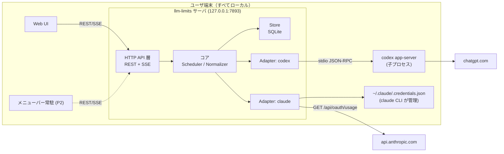
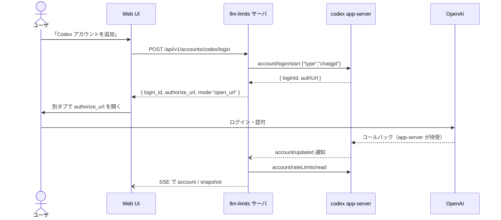
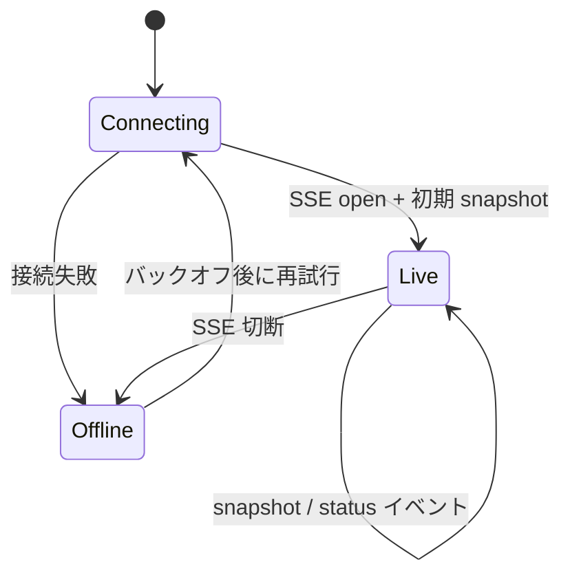

# llm-limits 詳細設計書

Claude（Anthropic サブスクリプション）と Codex（ChatGPT サブスクリプション）の
利用枠残量をリアルタイムに可視化するデスクトップアプリの詳細設計。

- ステータス: Draft v3
- 対象読者: 実装者
- 最終更新: 2026-08-29

> **v3 での変更（重要）**: 公式クライアントの OAuth client_id を流用する方式を**取りやめた**。
> 第三者アプリがそれを使うことは公式に認められておらず、クライアントなりすましに当たるため（§2）。
> 代わりに、Codex は公式に提供される `codex app-server` の JSON-RPC を、
> Claude は公式 CLI が管理するクレデンシャルを使う方式に変更した（§7）。
>
> **v3.1**: Claude も公開拡張点（**statusLine**）で残量を取得できることが判明したため、
> こちらを既定にした（§6.3）。**既定構成では非公開 API への依存がゼロになり、
> 本アプリからの外向き通信も無くなった。** `/api/oauth/usage` は opt-in の副次手段に降格。
>
> v2 での変更: 両プロバイダの残量取得手段を実物から確定させた。
>
> あわせて技術選定を再検討した。v1 で Go を選んだ理由のうち 2 つ（キーチェーン抽象、
> 自前 OAuth の暗号処理）は v3 で失効したが、単一バイナリ・低メモリ・子プロセス管理という
> 常駐デーモンとしての理由が残るため Go を継続する。詳細と却下した代替は §5.1。

---

## 1. 目的とスコープ

### 1.1 目的

複数の LLM サブスクリプション契約について、**5時間枠と週間枠それぞれの消費率と次回リセット日時**を
常時把握できるようにする。作業の中断・待ち時間を減らすことが狙い。

### 1.2 表示要件（確定）

アカウントごとに、次の 2 行を表示する。これが本アプリの中核要件。

| 行 | 内容 |
|---|---|
| 5時間枠 | 消費率(%) と 次回リセット日時 |
| 週間枠 | 消費率(%) と 次回リセット日時 |

これ以外の枠（Claude の Opus 専用週間枠、Codex の追加レート制限、クレジット残高など）は
取得はするが、既定では折りたたみ、詳細表示でのみ出す。

### 1.3 スコープ

| フェーズ | 対象 | 本設計での扱い |
|---|---|---|
| P1 | サーバ（ローカル常駐デーモン） | 詳細設計 |
| P1 | ログイン用 Web 画面 | 詳細設計 |
| P1 | 残量表示 Web UI | 詳細設計 |
| P2 | 各 OS のメニューバー常駐クライアント | API 契約のみ確定、実装は後続 |

### 1.4 非スコープ

- 課金額・トークン単価の集計（API 従量課金は扱わない。サブスク枠のみ）
- マルチユーザ / チーム共有。**単一ユーザのローカル実行専用**
- クラウドホスティング

### 1.5 設計原則

1. **公式インタフェースのみを使う**。公式クライアントの識別子を騙らない（§2）。
2. **ローカル完結**: サーバは `127.0.0.1` にのみバインドし、クレデンシャルは端末外に出さない。
3. **プロバイダ非依存のコア**: コアは正規化済みモデルだけを扱い、差異は Adapter に閉じ込める。
4. **控えめな取得**: push があるものは push で受け、無いものだけ控えめにポーリングする。
5. **UI は API のクライアントに過ぎない**: Web UI とメニューバーアプリは同じ REST/SSE を使う。

---

## 2. 前提となる制約: 公式クライアント識別子は流用しない

本設計で最も強い制約であり、アーキテクチャの形を決めているため最初に置く。

### 2.1 判断

**Codex / Claude の OAuth `client_id` を本アプリが名乗ることはしない。**

一時期の検討案では、公開ソースやバイナリから読み取れる `client_id`
（Codex: `app_EMoamEEZ73f0CkXaXp7hrann`、Claude: `9d1c250a-…`）を使って
本アプリ自身が OAuth ログイン画面を持つ構成を検討した。これは採用しない。

### 2.2 理由

| # | 根拠 |
|---|---|
| 1 | **Apache-2.0 はコードのライセンスであって、サービス利用の許諾ではない。** `openai/codex` の LICENSE / NOTICE が与えるのは著作権・特許の実施権であり、OpenAI のバックエンドへのアクセス権や OAuth クライアント登録の利用許諾は含まない。同ライセンス §6 は商標権を明示的に除外しており、「登録済みクライアントとして名乗る」行為はコードの利用より商標的な識別子の借用に近い |
| 2 | **Codex 自身が first-party クライアントを区別している。** `is_first_party_originator()` は `codex_cli_rs` / `codex-tui` / `codex_vscode` / `Codex *` のみを first-party と判定する（§18-C10）。`originator` は authorize URL のクエリにもリクエストヘッダにも乗るため、第三者アプリがこれらを送ることは「自分は OpenAI 純正クライアントである」と申告することになる |
| 3 | **第三者が自前の client_id を登録する公開制度が見当たらない。** ChatGPT / Claude のサブスクリプションアカウントに対する third-party OAuth 登録の公開窓口は確認できなかった |
| 4 | **残量エンドポイントはいずれも文書化されていない内部 API である。** `/backend-api/wham/usage`、`/api/oauth/usage` とも公開ドキュメントが存在しない |

Claude 側は CLI のソースが非公開であり、根拠はさらに薄い。

### 2.3 帰結

- Codex: **公式に提供される `codex app-server` の JSON-RPC を使う**（§6.2）。
  ログインも残量取得もこの経路で完結し、なりすましは発生しない。
- Claude: **公式 CLI が管理するクレデンシャルを使う**（§6.3）。
  本アプリは OAuth フローを実装しない。
- **両プロバイダとも、公式 CLI がインストール済みであることを前提にする。**
  これは当初要件（アプリ自身が OAuth ログイン画面を持つ）からの後退だが、
  §2.2 を踏まえると受け入れるべき制約である。
  なお Codex についてはログインの起点となる Web 画面は維持できる（§8.1）。

---

## 3. 用語

| 用語 | 定義 |
|---|---|
| Provider | `claude` / `codex` のいずれか |
| Account | Provider に紐づく 1 つのログイン済みアカウント |
| Window | リセット周期を持つ利用枠。本アプリでは主に 5時間枠 と 週間枠 |
| Snapshot | ある時刻に取得した Account の全 Window の状態 |
| Adapter | Provider 固有の取得手段を実装するモジュール |
| app-server | `codex app-server` が提供する stdio JSON-RPC サーバ |

---

## 4. 全体アーキテクチャ



**Codex の残量取得は app-server が肩代わりする**ため、本アプリから
`chatgpt.com` への直接通信は発生しない。Claude のみ自前で HTTP を叩く。

### 4.1 プロセス構成

| プロセス / goroutine | 役割 |
|---|---|
| `http` | API + Web UI の待受（固定ポート 7893） |
| `codex app-server`（アカウント数分の**子プロセス**） | Codex のログイン・残量取得 |
| `scheduler` | Claude アカウントのポーリング |
| `broker` | Snapshot 更新を SSE 購読者へファンアウト |

---

## 5. 技術選定

### 5.1 サーバ: Go

v3 で自前 OAuth とトークン保存が無くなったため、**v1 で挙げた選定理由のうち 2 つは失効した**
（OS キーチェーン抽象が 3 OS 揃うこと、PKCE 等の暗号処理）。
再検討したうえで Go を継続する。判断が変わっていないことより、
**なぜ今も妥当なのか**が重要なので、現時点の理由を書き直す。

**継続する理由**

1. **単一静的バイナリ**（cgo なし、約 15MB）。CI から 3 OS 分をクロスコンパイルでき、
   配布物が 1 ファイルで済む。P2 のメニューバーアプリが子プロセスとして起動する
   常駐デーモンであり、ランタイムの同梱が要らないことが効く。
2. **常駐時のメモリフットプリントが小さい**（想定 20–30MB）。常時起動が前提のため。
3. **長命な子プロセスの管理**が標準ライブラリで完結する。v3 で app-server 駆動になり、
   SIGTERM→SIGKILL、異常終了時の再起動、ゾンビ回収、3 OS でのプロセスツリー終了が
   中核の関心事になった（§12）。**これは v3 で新たに増えた Go 寄りの要素である。**

| 用途 | ライブラリ |
|---|---|
| HTTP | 標準 `net/http` |
| DB | `modernc.org/sqlite`（pure Go / cgo 不要） |
| ログ | 標準 `log/slog` |
| キーチェーン | `github.com/zalando/go-keyring`（**Claude の長期トークン 1 件のみ**。§7.2） |

### 5.2 app-server プロトコル型の生成

`openai/codex` は app-server v2 プロトコルの **完全な JSON Schema** を同梱している
（`codex-rs/app-server-protocol/schema/json/codex_app_server_protocol.v2.schemas.json`、
616 定義。`GetAccountRateLimitsResponse` / `RateLimitSnapshot` / `RateLimitWindow` を含む）。

**これを vendor し、`go-jsonschema` で型を生成する。手書きしない。**

```
schema/codex_app_server_protocol.v2.schemas.json   # vendor（版を固定）
internal/adapter/codex/gen/                        # 生成物（コミットする）
```

```makefile
# make gen-codex-protocol
gen-codex-protocol:
	go-jsonschema -p gen --tags json 	  schema/codex_app_server_protocol.v2.schemas.json 	  -o internal/adapter/codex/gen/protocol.go
```

**生成物をコミットするのは、差分がプロトコル変更の検知器になるため。**
schema を更新して `make gen-codex-protocol` を回し、diff が出れば
上流の変更が可視化される。これが R2（プロトコル変更で壊れる）への能動的な備えになる。

> 生成ステップが不要な選択肢として TypeScript も検討した。上流は生成済みの `.ts` 型も
> 同梱している（`schema/typescript/v2/` に 608 ファイル）ため、そのまま取り込める。
> ただし JSON Schema があるため型の入手は Go でも 1 コマンドで済み、差は生成ステップの
> 有無だけだった。`@openai/codex-sdk` は thread/exec 専用で `account/rateLimits` を
> 含まないため、TS を選んでも JSON-RPC クライアントは自前になる点も変わらない。
> 一方で常駐バイナリのサイズ（`bun build --compile` で 60–100MB）と Windows での
> 子プロセス終了の作り込みが増えるため、採用しなかった。
>
> P2 の Tauri が確定するなら Rust に寄せて P1/P2 を 1 プロセスに畳む案もあるが、
> 実装速度を優先して見送った。

### 5.3 Web UI: 素の TS + Vite

画面数が 2 つ、状態も Snapshot のリストのみ。ビルド成果物は Go の `embed.FS` に載せる。
サーバと言語が分かれるが、この規模では許容する。

### 5.4 メニューバー常駐（P2 の方針のみ）: Tauri v2

サーバとは REST/SSE のみで会話するため、後で Electron に翻意しても設計への影響はない。

---

## 6. Provider Adapter

### 6.1 インタフェース

```go
type Adapter interface {
    Provider() Provider

    // アカウント検出。設定済みのものを列挙する（ログインは各 Provider の作法に従う）
    Discover(ctx context.Context) ([]Account, error)

    // 残量取得。push 型の Adapter は Subscribe を実装し、Fetch はフォールバックになる
    Fetch(ctx context.Context, a Account) ([]Window, error)
    Subscribe(ctx context.Context, a Account, ch chan<- []Window) error // 非対応なら ErrNoPush

    // ログイン導線。方式は Provider ごとに異なる (§8)
    BeginLogin(ctx context.Context) (*LoginHandle, error)

    MinInterval() time.Duration
}
```

エラー分類:

| 種別 | 意味 | 動作 |
|---|---|---|
| `ErrNotInstalled` | 公式 CLI が見つからない | UI に導入手順を表示。ポーリングしない |
| `ErrNeedsLogin` | CLI 側で未ログイン | UI にログイン導線を表示 |
| `ErrTransient` | ネットワーク・一時障害 | 指数バックオフ、前回値を `Stale=true` で維持 |
| `ErrSchema` | 応答の形が想定と違う | 長い間隔でリトライ。**仕様変更の検出点** |

---

### 6.2 Codex Adapter — `codex app-server` 駆動

出典: `openai/codex`（Apache-2.0）commit `6478a75`。詳細は §18-C。

#### 起動と接続

```
codex app-server        # 環境変数 CODEX_HOME でアカウントを切り替える
```

stdio 上の JSON-RPC で会話する。`initialize` でハンドシェイクした後、
以下のメソッド・通知を使う。**いずれも公式 SDK（`sdk/python` の生成コード）に
型付きで含まれる公開インタフェースであり、内部 API ではない。**

| 方向 | メソッド / 通知 | 用途 |
|---|---|---|
| →  | `initialize` | ハンドシェイク |
| →  | `account/read` | ログイン中のアカウント情報 |
| →  | `account/login/start` | ログイン開始。`authUrl` を得る（§8.1） |
| →  | `account/login/cancel` | ログイン中断 |
| →  | `account/rateLimits/read` | **残量の取得** |
| ←  | `account/rateLimits/updated` | **残量更新の push 通知** |
| ←  | `account/updated` | アカウント状態の変化 |

#### `account/rateLimits/read` のレスポンス

```jsonc
{
  "rateLimits": {                       // 既定バケット
    "limitId": "codex",
    "limitName": null,
    "primary":   { "usedPercent": 12, "windowDurationMins": 300,   "resetsAt": 1786000000 },
    "secondary": { "usedPercent": 27, "windowDurationMins": 10080, "resetsAt": 1786400000 },
    "credits": { "hasCredits": true, "unlimited": false, "balance": "12.50" },
    "planType": "pro"
  },
  "rateLimitsByLimitId": { "codex": { ... }, "codex_other": { ... } },
  "rateLimitResetCredits": { "availableCount": 0, "credits": [] }
}
```

**正規化時の注意 3 点**

1. JSON は **camelCase**（Rust 側の `#[serde(rename_all = "camelCase")]` による）。
2. `usedPercent` は **すでに 0–100 の整数**。Claude と違い ×100 しない。
3. `resetsAt` は **Unix エポック秒**。
4. `Kind` は **`windowDurationMins` から判定**する（§9.1）。
   `primary` = 5時間、`secondary` = 週間 という対応は**保証されていない**
   （Codex CLI 自身も窓の長さからラベルを導出している。§18-C4）。

`rateLimitsByLimitId` の既定以外のバケットと `credits` は `other` として取り込み、
詳細表示でのみ出す。

#### push の扱い

`account/rateLimits/updated` 通知を受けたら、その内容をそのまま Snapshot に反映する。
**Codex については定期ポーリングを行わない。**
起動時と、通知が 30 分途絶えた場合の保険としてのみ `account/rateLimits/read` を呼ぶ。

#### プロセス管理

| 事象 | 動作 |
|---|---|
| `codex` が PATH にない | `ErrNotInstalled`。UI に導入手順を表示 |
| 子プロセスが異常終了 | 指数バックオフ（1s → 60s 上限）で再起動。直近 Snapshot は `Stale=true` で維持 |
| サーバ終了 | 全子プロセスに SIGTERM → 5 秒後に SIGKILL |
| 複数アカウント | **`CODEX_HOME` を変えた app-server プロセスを account ごとに 1 つ**持つ |

> **複数アカウントについて**: app-server プロトコルに複数アカウントを
> 1 プロセスで扱う API は現時点で通っていない（`AccountSessionsAdd` は型のみ存在し、
> メソッドが未接続）。したがって `CODEX_HOME` を分ける方式を採る。
> 既定アカウントは `CODEX_HOME` 未設定（`~/.codex`）の 1 つ。

---

### 6.3 Claude Adapter — statusLine 経由の push を第一手段にする

出典: Claude Code CLI 実行バイナリ内の文字列。詳細は §19-A。

Claude Code には **statusLine** という公開された拡張点があり、
ユーザが設定したコマンドに JSON を stdin で渡す。
**この JSON に `rate_limits` が含まれる。** Codex の app-server に相当する、
文書化された正規の経路がここにある。

```jsonc
// statusLine コマンドの stdin に渡る JSON（本アプリが使う部分のみ）
{
  "session_id": "…",
  "rate_limits": {          // サブスク契約者のみ。最初の API 応答の後、
                            // かつ窓が存在する間だけ現れる
    "five_hour":   { "used_percentage": 42.0, "resets_at": 1786000000 },
    "seven_day":   { "used_percentage": 61.5, "resets_at": 1786400000 },
    "spend_limit": { "used_percentage": 10.0, "resets_at": 1786400000 }
  }
}
```

- `used_percentage` は **すでに 0–100**（100 超もありうる）。
  **`/api/oauth/usage` の `utilization`(0–1) とは違う。** ×100 しない。
- `resets_at` は **Unix エポック秒**。
- `five_hour` / `seven_day` はいずれも「API が報告していて、かつ
  `resets_at` を過ぎていない間だけ」現れる optional フィールド。

CLI 自身のヘルプにも `jq -r '.rate_limits.five_hour.used_percentage'` を使う
statusLine の例が載っており、**この用途は想定された使い方である**（§19-A13）。

#### 取り込みの仕組み

本アプリのバイナリに `llm-limits statusline` サブコマンドを持たせ、
ユーザにはこれを statusLine として登録してもらう。

```jsonc
// ~/.claude/settings.json
{ "statusLine": { "type": "command", "command": "llm-limits statusline" } }
```

このサブコマンドは、

1. stdin の JSON を読む
2. `rate_limits` を `POST /api/v1/ingest/claude` へ転送する（§10.1）
3. **stdout に表示用の文字列を返す**（例: `5h:42% 7d:62%`）

3 を行うのが要点で、**ユーザ自身の statusLine としても役に立つ**ため、
「本アプリのためだけに設定を汚す」形にならない。

サブコマンドの制約:

- サーバへの POST は**タイムアウト 300ms、失敗しても黙って続行**する。
  statusLine は対話体験の一部であり、本アプリの都合で `claude` を遅くしてはならない。
- サーバの Bearer トークンは `<config_dir>/llm-limits/api.token` から読む（§13.2）。
- 標準エラーに何も出さない（statusLine の描画を壊さないため）。

#### この経路の制約（正直に書く）

| 制約 | 影響と対処 |
|---|---|
| **Claude Code のセッションが動いている間しか届かない** | アイドル時は更新されない。最終値を `Stale=true` で保持し「最終取得 N 分前」を出す |
| 最初の API 応答の前は `rate_limits` が無い | セッション開始直後は値が来ない。既存の最終値を出し続ける |
| ペイロードにアカウント識別子が無い | サブコマンドが自身の `CLAUDE_CONFIG_DIR`（未設定なら既定）を併せて送り、それをアカウントの識別子にする |
| 複数セッションが同時に走る | 同一アカウントに複数の更新が届く。`fetched_at` が最新のものを採用する |

`resets_at` を過ぎた後は、その窓がリセットされたことが**分かる**。
UI ではこれを「リセット済み（推定）」として、**実測値と区別して**表示する
（0% と断定しない。リセット後にすでに消費している可能性があるため）。

#### 副次手段: `/api/oauth/usage`（既定では無効）

常時更新がどうしても必要な場合のために、公式 CLI のクレデンシャルを使って
`GET https://api.anthropic.com/api/oauth/usage` を叩く経路も実装するが、
**既定では無効**とし、設定で明示的に有効化させる。
非公開エンドポイントであることを設定画面に明記する。

```
GET https://api.anthropic.com/api/oauth/usage?at_wall=1&skip_spend=1
Authorization: Bearer <access_token>
anthropic-beta: oauth-2025-04-20
```

トークンの入手経路（優先順）:

| 順位 | 経路 | 位置づけ |
|---|---|---|
| 1 | `claude setup-token` の長期トークン | 公式に用意されたプログラム利用向けの手段。UI で貼り付けてもらう |
| 2 | 環境変数 `CLAUDE_CODE_OAUTH_TOKEN` | 同上を環境変数で渡す形 |
| 3 | `$CLAUDE_CONFIG_DIR ?? ~/.claude` 配下の `.credentials.json` | CLI のログイン結果を読む |

**トークンのリフレッシュは自前でしない。** 経路 3 では期限切れの更新を `claude` CLI に委ね、
ファイルの **mtime を監視**して読み直す（CLI 自身も同じ方法で更新を検知している。§19-A7）。
本アプリからトークンエンドポイントを叩かない（リフレッシュトークンのローテーションを
CLI と奪い合うと、CLI 側のログインを壊しうるため）。

macOS では CLI が Keychain にクレデンシャルを置く場合がある。
**Keychain 上のサービス名は未確認**のため、確認できるまで macOS では経路 1 のみを提示する。

レスポンスの正規化（この経路のみ）:

```json
{
  "five_hour":  { "utilization": 0.42,  "resets_at": 1786000000 },
  "seven_day":  { "utilization": 0.615, "resets_at": 1786400000 },
  "seven_day_opus": { "utilization": 0.10, "resets_at": 1786400000 }
}
```

**`utilization` は 0.0–1.0 の小数。`UsedPercent` へは ×100 する。**
statusLine 経路と単位が違うため、**正規化は経路ごとに別関数に分け、
それぞれに回帰テストを置く**（§16）。

#### Window のマッピング

Claude は窓の長さを返さないため、**キー名で分類**する。

| キー | 経路 | `Kind` | `Label` | 既定表示 |
|---|---|---|---|---|
| `five_hour` | 両方 | `five_hour` | 5時間枠 | ✅ |
| `seven_day` | 両方 | `weekly` | 週間枠 | ✅ |
| `spend_limit` | statusLine | `other` | 上限額 | 詳細のみ |
| `seven_day_opus` 他 | usage API | `other` | 週間枠(Opus) 等 | 詳細のみ |

未知のキーは `other` として取り込み、落とさない。


### 6.4 依存する非公開インタフェースについて

**既定の構成では、非公開インタフェースへの依存はゼロになった。**
Codex は app-server、Claude は statusLine と、いずれも公開された拡張点だけで完結する。

`/api/oauth/usage` は §6.3 の副次手段としてのみ残り、**既定では無効**である。
有効化した場合にのみ以下が当てはまる。

- `ErrSchema` を明示的に検出・ログ化し、仕様変更に気づける状態を保つ（§14.2）
- リクエスト量は公式クライアントの通常利用を上回らない水準に抑える（§9.2）
- 自分のアカウントの状態を自分で読む用途に限定する

---

## 7. データモデルと保存

### 7.1 正規化モデル

```go
type Provider string   // "claude" | "codex"

type WindowKind string
const (
    WindowFiveHour WindowKind = "five_hour"
    WindowWeekly   WindowKind = "weekly"
    WindowOther    WindowKind = "other"
)

type Window struct {
    Kind        WindowKind
    Key         string     // Provider 固有の原キー（"seven_day_opus" 等）
    Label       string     // "5時間枠" / "週間枠(Opus)"
    UsedPercent float64    // 0.0 - 100.0 に正規化済み
    ResetsAt    *time.Time // 次回リセット日時
    WindowMin   *int       // 枠の長さ（分）。Provider が返す場合のみ
}

type Account struct {
    ID        string   // ULID
    Provider  Provider
    Label     string   // 表示名（既定はメールアドレス）
    Subject   string   // Provider 側の識別子
    Plan      string   // "max20x" / "pro" 等
    Status    Status   // ok | needs_login | not_installed | error | disabled
    CodexHome string   // codex のみ。CODEX_HOME のパス
}

type Snapshot struct {
    AccountID string
    FetchedAt time.Time
    Windows   []Window
    Stale     bool
    Err       string
}
```

### 7.2 本アプリはトークンを保存しない

**v2 からの最大の変更点。** OAuth を自前で実装しなくなったため、
アクセストークン・リフレッシュトークンを本アプリが永続化する必要がなくなった。

| Provider | トークンの所在 | 本アプリの扱い |
|---|---|---|
| Codex | `$CODEX_HOME/auth.json`（codex CLI が管理） | **触らない。** app-server 越しに結果だけ受け取る |
| Claude 経路1 | ユーザが貼り付けた長期トークン | OS キーチェーンに保存（`go-keyring`） |
| Claude 経路3 | `~/.claude/.credentials.json`（claude CLI が管理） | **読むだけ。書き込まない** |

キーチェーンを使うのは Claude の経路 1 のみ。
これによりキーチェーン非対応環境向けの暗号化ファイル実装（v2 の §7.1）は不要になった
（その環境では経路 3 か環境変数を使う）。

### 7.3 永続化スキーマ（SQLite）

`<config_dir>/llm-limits/data.db`（0600）

```sql
CREATE TABLE accounts (
    id          TEXT PRIMARY KEY,
    provider    TEXT NOT NULL,
    label       TEXT NOT NULL,
    subject     TEXT NOT NULL,
    plan        TEXT NOT NULL DEFAULT '',
    status      TEXT NOT NULL DEFAULT 'ok',
    codex_home  TEXT NOT NULL DEFAULT '',
    created_at  INTEGER NOT NULL,
    UNIQUE(provider, subject)
);

CREATE TABLE snapshots (
    account_id  TEXT PRIMARY KEY REFERENCES accounts(id) ON DELETE CASCADE,
    fetched_at  INTEGER NOT NULL,
    payload     TEXT NOT NULL   -- []Window の JSON
);

CREATE TABLE snapshot_history (
    account_id  TEXT NOT NULL REFERENCES accounts(id) ON DELETE CASCADE,
    fetched_at  INTEGER NOT NULL,
    window_kind TEXT NOT NULL,
    used_pct    REAL NOT NULL,
    PRIMARY KEY (account_id, window_kind, fetched_at)
);
```

### 7.4 ログ

トークンはログに出さない。`slog.Handler` にマスキングフィルタを噛ませ、
キー名に `token` / `secret` / `authorization` を含む値を一律 `***` にする。
**app-server との JSON-RPC を debug ログに落とす際も同じフィルタを通す**
（`account/login/start` の応答や `account/read` にアカウント情報が含まれるため）。

---

## 8. ログイン導線

自前の OAuth を実装しないため、Provider ごとに導線が異なる。
UI は「アカウントを追加」から始まる 1 つの流れに見せる。

### 8.1 Codex: app-server 経由（Web 画面から開始できる）

**当初要件「Web 画面から OAuth ログイン」は Codex については維持できる。**
本アプリは認可 URL を自分で組み立てず、app-server から受け取るだけ。
コールバックの待受（ポート 1455）も app-server 側が行う。



中断は `account/login/cancel { loginId }`。
**ポート 1455 の bind は app-server の責務**なので、本アプリは関与しない
（v2 で設計した一時待受は不要になった）。

### 8.2 Claude: statusLine の設定（ログインは不要）

Claude 側は**そもそもログインが要らない**。本アプリは認証情報を一切扱わず、
statusLine から流れてくる値を受け取るだけである（§6.3）。
追加画面の役割は「設定手順の案内」になる。

```
┌──────────────────────────────────────────────────────┐
│ Claude アカウントを追加                               │
├──────────────────────────────────────────────────────┤
│ Claude Code の statusLine から残量を受け取ります。     │
│ 認証情報は扱いません。                                 │
│                                                       │
│ ~/.claude/settings.json に次を追加してください：       │
│   "statusLine": {                                     │
│     "type": "command",                                │
│     "command": "llm-limits statusline"                │
│   }                                          [コピー] │
│                                                       │
│ [ 自動で追加する ]  ← 既存の statusLine 設定がない場合 │
│                                                       │
│ 状態: ⏳ Claude Code セッションからの受信を待機中…      │
│                                                       │
│                                        [ 閉じる ]     │
└──────────────────────────────────────────────────────┘
```

- **「自動で追加する」は既存の `statusLine` 設定が無い場合のみ有効化する。**
  ユーザが自分で設定した statusLine を本アプリが黙って上書きしてはならない。
  既存設定がある場合はスニペットの提示のみに留め、統合方法を案内する。
- 待機中に最初のペイロードが届いた時点でアカウントを登録する
  （`CLAUDE_CONFIG_DIR` を識別子とする。§6.3）。
- 副次手段（`/api/oauth/usage`）を使う場合のトークン投入欄は、
  設定画面の「詳細」以下に置き、既定では畳んでおく。

---

## 9. 取得タイミングの設計

### 9.1 Window の分類

```go
// 枠の長さから Kind を決める。Codex CLI と同じ ±5% の許容幅を使う。
func classifyByLength(minutes int64) WindowKind {
    switch {
    case approx(minutes, 5*60):    return WindowFiveHour
    case approx(minutes, 7*24*60): return WindowWeekly
    default:                       return WindowOther
    }
}
func approx(m, expect int64) bool {
    f, e := float64(m), float64(expect)
    return f >= e*0.95 && f <= e*1.05
}
```

Codex は `windowDurationMins` でこれを使い、Claude はキー名で分類する（§6.3）。
分類ロジックが Provider ごとに違うことこそ Adapter に閉じ込めるべき差異であり、
コアはこの結果だけを見る。

### 9.2 スケジューリング

| Provider | 方式 | 間隔 |
|---|---|---|
| Codex | **push**（`account/rateLimits/updated`） | 定期取得なし。起動時 + 通知が30分途絶えたときの保険のみ |
| Claude（既定） | **push**（statusLine からの ingest） | 定期取得なし。`claude` セッションが動いている間だけ届く |
| Claude（副次手段を有効化した場合のみ） | ポーリング | 既定 60 秒 |

**既定では両 Provider とも push であり、定期ポーリングは行わない。**
非公開エンドポイントを叩かないだけでなく、そもそも本アプリからの外向き通信が無くなる（§13.4）。

副次手段を有効化した場合の Claude のポーリングは次のように調整する。

```
interval = max(60s, userConfiguredInterval)

// リセット直後の値を早く取りたいので、リセット時刻をまたぐ場合は寄せる
if 0 < timeUntilNearestReset < interval {
    next = nearestReset + 5s
} else {
    next = now + interval
}
if backoff.active { next = backoff.nextAt }
next += jitter(±10%)
```

**UI 非表示時の抑制**: SSE の購読者が 0 かつ最終アクセスから 10 分経過している場合、
間隔を 5 倍に伸ばす。購読が復活したら即座に 1 回取得して通常間隔に戻す。

### 9.3 バックオフ

| 種別 | 間隔 |
|---|---|
| 429 | `Retry-After` があればそれ。無ければ 5分 → 10分 → 20分 → 30分（上限） |
| `ErrTransient` | 1分 → 2分 → 4分 → … → 30分（上限）。成功でリセット |
| `ErrSchema` | 30分固定。連続 3 回で `status=error`、UI に「取得方法の更新が必要」を表示 |
| app-server 異常終了 | 1秒 → 2秒 → … → 60秒（上限） |

すべて ±10% のジッタを付与する。

### 9.4 失敗時の表示方針

取得に失敗しても直近の Snapshot を保持し、`Stale=true` と `FetchedAt` を返す。
UI は値をグレーアウトし「最終取得: N 分前」を表示する。**値を消さない**
（残量の目安としては古い値の方が「不明」より有用なため）。

---

## 10. HTTP API 仕様

- ベース URL: `http://127.0.0.1:7893`
- 認証: `Authorization: Bearer <local_token>`（§13.2）
- 時刻は RFC3339（UTC）

```json
{ "error": { "code": "needs_login", "message": "claude CLI でログインしてください", "account_id": "01J..." } }
```

### 10.1 エンドポイント一覧

| Method | Path | 説明 |
|---|---|---|
| GET | `/api/v1/health` | 稼働確認。認証不要 |
| GET | `/api/v1/providers` | 各 Provider の CLI 検出状況とバージョン |
| GET | `/api/v1/accounts` | アカウント一覧 |
| POST | `/api/v1/accounts/codex/login` | app-server 経由でログイン開始（§8.1） |
| DELETE | `/api/v1/accounts/codex/login/{login_id}` | ログイン中断 |
| POST | `/api/v1/ingest/claude` | **statusLine からの残量受信**（§6.3）。Bearer 必須 |
| POST | `/api/v1/accounts/claude` | 副次手段のトークン投入（§6.3、既定では未使用） |
| PATCH | `/api/v1/accounts/{id}` | `label` / `disabled` の更新 |
| DELETE | `/api/v1/accounts/{id}` | 本アプリの管理対象から外す（**CLI 側はログアウトさせない**） |
| GET | `/api/v1/quotas` | 全アカウントの最新 Snapshot |
| GET | `/api/v1/quotas/{id}/history?kind=five_hour&hours=24` | 時系列 |
| POST | `/api/v1/accounts/{id}/refresh` | 即時取得（10秒に1回に制限） |
| GET | `/api/v1/stream` | SSE |
| GET / PUT | `/api/v1/config` | 設定 |

`DELETE /accounts/{id}` が CLI 側のログアウトを行わないのは重要な点で、
本アプリの都合で公式 CLI の状態を壊さないため。UI にもその旨を書く。

### 10.2 `POST /api/v1/ingest/claude`

`llm-limits statusline` サブコマンドが送るリクエスト。

```json
{
  "config_dir": "/Users/me/.claude",
  "session_id": "…",
  "rate_limits": {
    "five_hour": { "used_percentage": 42.0, "resets_at": 1786000000 },
    "seven_day": { "used_percentage": 61.5, "resets_at": 1786400000 }
  }
}
```

- `config_dir` がアカウントの識別子になる（`Account.Subject`）。未知なら新規登録する。
- `rate_limits` が欠落・空のリクエストは 204 を返して**何もしない**
  （セッション開始直後は正常に起こる。§6.3）。
- レスポンスは表示用の短い文字列を含めてもよいが、
  **サブコマンドはレスポンスを待たずに終了してよい**（タイムアウト 300ms）。

### 10.3 `GET /api/v1/quotas` レスポンス

```json
{
  "fetched_at": "2026-08-29T09:20:03Z",
  "accounts": [
    {
      "account": { "id": "01J8ZQ...", "provider": "claude", "label": "work@example.com",
                   "plan": "max20x", "status": "ok" },
      "snapshot": {
        "fetched_at": "2026-08-29T09:20:01Z", "stale": false,
        "windows": [
          { "kind": "five_hour", "key": "five_hour", "label": "5時間枠",
            "used_percent": 42.0, "resets_at": "2026-08-29T11:00:00Z" },
          { "kind": "weekly", "key": "seven_day", "label": "週間枠",
            "used_percent": 61.5, "resets_at": "2026-09-02T00:00:00Z" }
        ]
      }
    },
    {
      "account": { "id": "01J8ZR...", "provider": "codex", "label": "personal",
                   "plan": "pro", "status": "ok" },
      "snapshot": {
        "fetched_at": "2026-08-29T09:19:44Z", "stale": false,
        "windows": [
          { "kind": "five_hour", "key": "primary", "label": "5時間枠",
            "used_percent": 12.0, "resets_at": "2026-08-29T13:30:00Z", "window_min": 300 },
          { "kind": "weekly", "key": "secondary", "label": "週間枠",
            "used_percent": 27.0, "resets_at": "2026-09-02T09:00:00Z", "window_min": 10080 }
        ]
      }
    }
  ]
}
```

クライアントは `kind` で分岐する。**キー名で分岐してはならない。**

### 10.4 SSE (`GET /api/v1/stream`)

```
event: snapshot
data: {"account_id":"01J8ZQ...","snapshot":{...}}

event: account
data: {"action":"added","account":{...}}

event: status
data: {"account_id":"01J8ZQ...","status":"needs_login"}

: keepalive   ← 20 秒ごと
```

接続時にまず全アカウントの `snapshot` を流す（初期同期）。
切断時は指数バックオフ（1秒 → 30秒上限）で再接続する。

---

## 11. Web UI 設計

### 11.1 画面一覧

| 画面 | パス | 内容 |
|---|---|---|
| ダッシュボード | `/` | 全アカウントの残量カード一覧 |
| 設定 | `/settings` | アカウント追加/削除/リネーム、ポーリング間隔 |

### 11.2 ダッシュボード

```
┌────────────────────────────────────────────────────────┐
│ llm-limits                          ⟳ 3秒前       ⚙   │
├────────────────────────────────────────────────────────┤
│ ● Claude — work@example.com                    max20x  │
│   5時間枠  ▓▓▓▓▓▓░░░░░░░░  42%   11:00 リセット (2時間後) │
│   週間枠   ▓▓▓▓▓▓▓▓▓░░░░░  62%   9/2 09:00 (4日後)      │
│   ▸ その他の枠 (4)                                      │
├────────────────────────────────────────────────────────┤
│ ● Codex — personal                                pro  │
│   5時間枠  ▓▓░░░░░░░░░░░░  12%   13:30 リセット (4時間後) │
│   週間枠   ▓▓▓▓░░░░░░░░░░  27%   9/2 09:00 (4日後)      │
├────────────────────────────────────────────────────────┤
│ ⚠ Claude — old@example.com     claude CLI で要ログイン   │
└────────────────────────────────────────────────────────┘
```

- **リセット日時は絶対時刻を主、相対時間を従**として併記する。
  「2時間後」だけだと予定を立てにくく、絶対時刻だけだと直感が働かないため。
  日付が今日なら時刻のみ、翌日以降は日付を添える。
- 残量バーの色は 3 段階（`< 70%` 通常 / `70–90%` 注意 / `>= 90%` 警告）。
  **色だけに意味を持たせず**、数値とテキストラベルを併記する。
- `stale` のカードは彩度を落とし「最終取得 N 分前」を明示する。
- `needs_login` / `not_installed` は値を出さず、対処導線のみを出す。
- `kind: other` は既定で折りたたむ。

### 11.3 状態遷移（クライアント側）



`Offline` の間もキャッシュした最終値を表示し続け、
ヘッダに「サーバに接続できません」を出す。

### 11.4 メニューバー常駐クライアント（P2 の要件メモ）

- メニューバーには**最も逼迫している枠の使用率**を 1 つだけ数値表示（設定で固定も可）
- クリックでポップオーバー。中身はダッシュボードと同じ
- 閾値（既定 90%）超過で 1 度だけ OS 通知。リセットで再武装
- サーバプロセスは常駐アプリが子プロセスとして起動・監視する
  （起動済みなら `/api/v1/health` で検出して再利用）

---

## 12. 外部プロセスの扱い

app-server を子プロセスとして動かすため、v2 に無かった考慮点が増える。

| 項目 | 方針 |
|---|---|
| 実行ファイルの解決 | PATH 上の `codex` / `claude`。設定でフルパス指定も可 |
| バージョン確認 | 起動時に `--version` を取り、`/api/v1/providers` で見せる。JSON-RPC の互換性問題の切り分けに使う |
| 引数 | 固定。ユーザ入力を引数に渡さない |
| 環境変数 | `CODEX_HOME` のみ明示指定。**それ以外は親の環境を継承しない**（最小の環境で起動する） |
| stdout | JSON-RPC 専用。パース失敗行は捨ててログに残す |
| stderr | 行単位でログへ（`debug` レベル） |
| 標準入力 | 本アプリからの JSON-RPC のみ |
| 終了処理 | SIGTERM → 5 秒 → SIGKILL。ゾンビを残さない |

---

## 13. セキュリティ設計

### 13.1 攻撃面

| 資産 | 脅威 | 対策 |
|---|---|---|
| Claude 長期トークン | 他プロセスからの読み出し | OS キーチェーン |
| CLI のクレデンシャル | 本アプリによる破壊 | **読み取り専用**。書き込みもリフレッシュもしない（§6.3） |
| ローカル API | 同一端末の他プロセスからの利用 | `127.0.0.1` バインド + Bearer トークン |
| ローカル API | 悪意あるサイトからの CSRF / DNS リバインディング | Origin 検証 + `Host` 検証 + Bearer |
| 子プロセス | 引数・環境変数経由の注入 | 引数固定、環境変数は最小（§12） |
| ingest エンドポイント | 他プロセスによる偽の残量投入 | Bearer 必須。値は表示専用で、これを根拠に何かを実行することはない |
| ユーザの `settings.json` | 本アプリによる既存設定の破壊 | 既存 `statusLine` がある場合は**自動書き換えしない**（§8.2） |

### 13.2 ローカル API トークン

- 起動時に 32 バイト乱数を生成し、`<config_dir>/llm-limits/api.token`（0600）に保存
- Web UI はサーバが開く URL `http://127.0.0.1:7893/?t=<token>` で受け取り、
  `sessionStorage` に格納してから **`history.replaceState` で URL から即座に除去**する
- `/api/v1/health` 以外の全エンドポイントで必須
- メニューバーアプリはトークンファイルを直接読む

### 13.3 ブラウザ由来リクエストの制限

- `Origin` がある場合、`http://127.0.0.1:7893` / `http://localhost:7893` 以外は 403
- `Host` ヘッダも同様に検証（DNS リバインディング対策）
- CORS は許可しない
- 静的資産に CSP: `default-src 'self'; connect-src 'self'`

### 13.4 その他

- **既定構成では本アプリからの外向き通信は一切ない。**
  Codex 分は app-server が、Claude 分は `claude` 本体が行い、本アプリは結果を受け取るだけ。
  §6.3 の副次手段を有効化したときのみ `api.anthropic.com` への通信が発生する
- テレメトリ・クラッシュレポートの送信は行わない

---

## 14. 可観測性と運用

### 14.1 ログ

`log/slog` の JSON ハンドラ。既定 `info`、`--log-level=debug` で詳細化。
出力先は stderr と `<config_dir>/llm-limits/app.log`（10MB × 3 世代）。

主要イベント: 起動／終了、CLI の検出結果とバージョン、アカウント追加／削除、
取得の成否とレイテンシ、app-server の起動／異常終了、スキーマ不一致。
§7.4 のマスキングを必ず通す。

### 14.2 デバッグ用エンドポイント

`--debug` 起動時のみ有効。

| Path | 内容 |
|---|---|
| `/debug/adapters` | 各 Adapter の直近の生レスポンス（トークンはマスク） |
| `/debug/rpc` | app-server との直近 JSON-RPC 往復（同上） |
| `/debug/schedule` | 次回実行時刻とバックオフ状態 |

### 14.3 設定ファイル

`<config_dir>/llm-limits/config.toml`

```toml
port = 7893
open_browser_on_start = true

[providers]
codex_bin  = ""          # 空なら PATH から解決
claude_bin = ""
codex_homes = ["~/.codex"]   # 複数アカウントはここに追加

[polling]
claude_interval = "60s"
idle_multiplier = 5

[notify]
threshold_percent = 90
```

config_dir は macOS `~/Library/Application Support`、
Linux `$XDG_CONFIG_HOME`（既定 `~/.config`）、Windows `%APPDATA%`。

---

## 15. ディレクトリ構成

```
llm-limits/
├── cmd/llm-limits/
│   ├── main.go
│   └── statusline.go             # `llm-limits statusline` サブコマンド (§6.3)
├── internal/
│   ├── server/
│   │   ├── router.go
│   │   ├── middleware.go         # Bearer / Origin / Host 検証
│   │   ├── handlers_accounts.go
│   │   ├── handlers_quotas.go
│   │   ├── handlers_login.go
│   │   └── sse.go
│   ├── core/
│   │   ├── model.go              # Account / Window / Snapshot / WindowKind
│   │   ├── classify.go           # classifyByLength (§9.1)
│   │   ├── scheduler.go
│   │   └── errors.go
│   ├── adapter/
│   │   ├── adapter.go
│   │   ├── codex/
│   │   │   ├── appserver.go      # 子プロセス管理 + JSON-RPC
│   │   │   ├── gen/protocol.go   # JSON Schema からの生成物 (§5.2)。手書きしない
│   │   │   ├── normalize.go
│   │   │   └── normalize_test.go
│   │   └── claude/
│   │       ├── statusline.go     # ingest ペイロードの正規化 (既定経路)
│   │       ├── statusline_test.go
│   │       ├── creds.go          # 副次手段: setup-token / credentials.json / mtime 監視
│   │       ├── usage.go          # 副次手段: /api/oauth/usage
│   │       └── usage_test.go
│   ├── procmgr/                  # §12 の子プロセス共通処理
│   ├── store/{sqlite.go,keychain.go,migrations/}
│   └── config/config.go
├── schema/                       # vendor した app-server JSON Schema (§5.2)
├── web/                          # Vite。dist を go:embed
├── docs/design.md                # 本書
├── Makefile                      # gen-codex-protocol 等
└── .github/workflows/{release.yml,schema-drift.yml}
```

---

## 16. テスト方針

| 層 | 方針 |
|---|---|
| codex Adapter | app-server を**偽の子プロセス**（テスト用スタブバイナリ）に差し替え、JSON-RPC の往復を検証。実際の `codex` は起動しない |
| codex Adapter | 異常終了・再起動・通知途絶のシナリオをスタブから駆動 |
| claude Adapter (statusLine) | 実際の statusLine ペイロードを testdata に固定。`rate_limits` 欠落・部分欠落・100超の値を含める |
| claude Adapter (usage API) | 実 API から一度採取したレスポンスを testdata に固定。**ネットワークに出ない** |
| statusline サブコマンド | サーバ停止中・タイムアウト時に**非ゼロ終了せず、stderr にも出さず、stdout の表示文字列だけ返す**ことを検証 |
| 単位換算 | **経路ごとに独立した回帰テスト**を置く。statusLine の `used_percentage`(0–100)、usage API の `utilization`(0–1)、Codex の `usedPercent`(0–100) |
| classify | 300分→5h、10080分→weekly、境界（±5%）と想定外値 |
| Scheduler | `clock` を注入し、バックオフ・リセット寄せを検証 |
| Store | 一時ディレクトリの SQLite。キーチェーンはインメモリ実装に差し替え |
| API | `httptest` でミドルウェア（Bearer 欠落 403、不正 Origin 403）を検証 |
| E2E | app-server スタブ + Claude API スタブで、追加〜表示まで通す |
| 型生成 | `make gen-codex-protocol` の出力がコミット済み生成物と一致することを CI で検証。差分は「vendor した schema と生成物がずれている」ことを意味する |

**単位換算のテストを明示しているのは、`utilization`(0–1) と `usedPercent`(0–100) の
取り違えが「100倍ずれた値を自信を持って表示する」形の障害になるため。**

---

## 17. 実装フェーズ

| Phase | 内容 | 完了条件 |
|---|---|---|
| P0 | スケルトン: 設定、SQLite、HTTP、Bearer ミドルウェア | `/api/v1/health` が 200 |
| P1a | procmgr + app-server の JSON-RPC 疎通（`initialize` / `account/read`） | スタブと実 `codex` の両方で疎通 |
| P1b | `account/rateLimits/read` + `updated` 購読 + 正規化 | `codex` の TUI 表示と値が一致する |
| P1c | Web UI ダッシュボード + SSE | 5h/週間の消費率とリセット時刻がリアルタイム更新される |
| P1d | `account/login/start` によるログイン導線（§8.1） | Web 画面から Codex アカウントを追加できる |
| P2a | Claude: `statusline` サブコマンド + ingest（§6.3） | `claude` を動かすとダッシュボードに 5h/週間が出る |
| P2b | Claude: 副次手段（setup-token + `/api/oauth/usage`）を opt-in で追加 | 有効化時に `claude` の `/usage` と値が一致する |
| P3 | 設定画面、複数 CODEX_HOME、history、リリースワークフロー | 3 OS のバイナリが CI から出る |
| P4 | Tauri メニューバークライアント | 本設計の対象外（別途設計） |

Codex を先行させるのは、**公開インタフェースで仕様の確度が最も高く、
push があるためコア（正規化・SSE・UI）の検証台として速い**ため。

完了条件を「公式クライアントの表示と一致」に置いているのは、
正しさの基準がそこにしかないため。

---

## 18. リスクと未決事項

| # | 項目 | 影響 | 対応方針 |
|---|---|---|---|
| R1 | **公式 CLI のインストールが前提**になった | 導入の敷居が上がる | `/api/v1/providers` で検出状況と導入手順を明示。これは §2 の判断の代償として受け入れる |
| R2 | app-server の JSON-RPC が将来変わる | 機能停止 | 起動時にバージョンを記録。`ErrSchema` 検出と `/debug/rpc`（§14.2）。加えて上流 schema の定期取得と生成物 diff で**変更を能動検知**する（§5.2、`schema-drift.yml`） |
| R3 | **Claude の値が `claude` 実行中しか更新されない** | アイドル時に値が古くなる | `Stale` と「最終取得 N 分前」を明示。`resets_at` 経過後は「リセット済み（推定）」と区別表示（§6.3）。常時更新が要る場合のみ副次手段を opt-in |
| R3b | Claude の `/api/oauth/usage` は非公開 | 機能停止 | **既定では使わない**ため既定構成には影響しない。有効化時のみ `ErrSchema` 検出 |
| R4 | ユーザの `statusLine` 設定を壊す | 既存の統計表示が消える | 既存設定があれば自動書き換えしない（§8.2）。副次手段の credentials.json は読み取り専用に徹する |
| R5 | app-server の複数アカウント API が未接続 | 複数アカウントが煩雑 | `CODEX_HOME` を分ける方式で回避。将来 API が通れば単一プロセス化する |
| R6 | 単位スケールの取り違え | 100倍ずれた値の表示 | 換算を Adapter 内に閉じ、§16 の回帰テストで固定 |
| R7 | 子プロセスのリーク・ゾンビ | 常駐アプリとして致命的 | §12 の終了処理。E2E で異常終了シナリオを回す |

### 実装着手前に確認すべきこと

1. **macOS で `claude` が Keychain に置くクレデンシャルのサービス名**（未確認）。
   確認できるまで macOS では setup-token 経路のみを提示する（§6.3）。
2. `claude setup-token` の長期トークンで `/api/oauth/usage` が通るか（未検証）。
   通らなければ Claude は credentials.json 経路が既定になる。
3. `codex app-server` の `initialize` パラメータの必須項目。
   → 公式 SDK（`sdk/python`）の生成コードに型があるため、実装時に参照できる。

いずれも**設計の骨格には影響しない**（Adapter 内に閉じている）。

---

## 19. 根拠となる出典

本設計の Provider 固有の記述は、以下の実物から確認した。**推測で書いた箇所はない。**

### A. Claude

出典: Claude Code CLI 実行バイナリ（`/opt/claude-code/bin/claude`、2026-08 時点）内の文字列。
ソースは非公開のため配布物からの確認となる。

| # | 事実 |
|---|---|
| A1 | 使用量エンドポイント `/api/oauth/usage`、および `?at_wall=1&skip_spend=1` 付きの軽量版 |
| A2 | `GET`、`timeout: 5000`、`Content-Type: application/json` |
| A3 | beta ヘッダ `oauth-2025-04-20` |
| A4 | レスポンス構造 `five_hour` / `seven_day` / `seven_day_opus` / `seven_day_sonnet` / `seven_day_oauth_apps` / `overage` の各キーに `{utilization, resets_at}` |
| A5 | `used_percentage: utilization * 100` の換算が存在 → `utilization` は 0–1 |
| A6 | `resets_at * 1000 > Date.now()` の比較が存在 → エポック**秒** |
| A7 | `.credentials.json` の **mtime を監視**して更新を検知する実装が存在 |
| A8 | クレデンシャルのパスは `$CLAUDE_CONFIG_DIR ?? ~/.claude` 配下の `.credentials.json` |
| A9 | 環境変数 `CLAUDE_CODE_OAUTH_TOKEN` を参照する分岐が存在 |
| A10 | CLI サブコマンドに `setup-token`（「長期認証トークンの設定。Claude サブスクリプションが必要」）が存在。**`usage` サブコマンドは存在しない** |
| A11 | **statusLine の stdin JSON に `rate_limits` が含まれる。** 説明文: 「Optional: Claude.ai subscription usage limits, or a Claude gateway spend limit. Only present for subscribers, or behind a gateway that sets a spend limit for you, after first API response, while at least one window is present.」 |
| A12 | その下位フィールド。`five_hour`（「Optional: 5-hour session limit (present only while the API reports it and its resets_at has not passed)」）、`seven_day`、`spend_limit`。各々 `used_percentage: number // Percentage of the limit used (0-100, above 100 once exceeded)` と `resets_at: number // Unix epoch seconds when this window resets` |
| A13 | **CLI 同梱の statusLine 例が `rate_limits` を使っている**: `jq -r '.rate_limits.five_hour.used_percentage'` / `.rate_limits.seven_day.used_percentage` / `.rate_limits.spend_limit.used_percentage` → 想定された使い方である根拠 |
| A14 | statusLine の設定項目に `timeoutMs` / `refreshIntervalMs` / `outputBehavior` / `path` / `script` / `interpreter` が存在 |
| A15 | statusLine ペイロードにアカウント／組織／メールの識別子は見当たらない（`session_id` はある）→ §6.3 で `CLAUDE_CONFIG_DIR` を識別子に使う理由 |

### B. Codex（公開インタフェース＝本設計が依存する部分）

出典: [`openai/codex`](https://github.com/openai/codex)（Apache-2.0）commit `6478a75`。

| # | 事実 | ファイル |
|---|---|---|
| C1 | `account/rateLimits/read` の定義（`#[experimental]` 指定なし＝安定 API） | `codex-rs/app-server-protocol/src/protocol/common.rs:1229` |
| C2 | `account/rateLimits/updated` 通知 | 同 `:1902`、`codex-rs/app-server/src/outgoing_message.rs:855` |
| C3 | `GetAccountRateLimitsResponse { rateLimits, rateLimitsByLimitId, rateLimitResetCredits }` | `.../protocol/v2/account.rs:310-319` |
| C4 | `RateLimitWindow { usedPercent: i32, windowDurationMins, resetsAt }`（camelCase） | 同 `:645-651` |
| C5 | `account/login/start` が `{ loginId, authUrl }` を返す（`type: "chatgpt"`） | `common.rs:1196`、`v2/account.rs:136-149` |
| C6 | `account/login/cancel` / `account/read` / `account/logout` | `common.rs:1217,1223,1363` |
| C7 | 上記が公式 SDK に生成済みの型として含まれる | `sdk/python/src/openai_codex/generated/v2_all.py:6403`、`notification_registry.py:80` |
| C8 | **枠の長さからラベルを導出**（5h / daily / weekly / monthly / annual、±5%） | `codex-rs/tui/src/chatwidget/rate_limits.rs:77-106` |
| C9 | 複数アカウント API は型のみで未接続（`AccountSessionsAddParams`） | `v2/account.rs:194` |
| C10 | **first-party originator の判定**（`codex_cli_rs` / `codex-tui` / `codex_vscode` / `Codex *`） | `codex-rs/login/src/auth/default_client.rs:153-158` — §2.2 の根拠 |

### C. Codex（採用しなかった経路の記録）

以下は §2 の判断により**使わない**が、なぜ使わないかの判断材料として記録する。

| 事実 | ファイル |
|---|---|
| 直接叩ける使用量エンドポイント `{base}/wham/usage` | `codex-rs/backend-client/src/client/rate_limit_resets.rs:81-84` |
| そのリクエストヘッダ（Bearer + `ChatGPT-Account-Id`） | `codex-rs/backend-client/src/client.rs:242-262` |
| OAuth 定数（client_id / issuer / ポート 1455 / scope） | `codex-rs/login/src/server.rs:59-60,176,575-611`、`auth/manager.rs:197-201,1708` |

**C8 の含意**: Codex CLI 自身が「primary = 5時間」と決め打ちせず窓の長さから
ラベルを導出している。本設計が §9.1 で `classifyByLength` を採る根拠がこれで、
`primary`/`secondary` という位置に意味を持たせるべきではない。
